# karpenter-provider-ssh

[](https://github.com/dklesev/karpenter-provider-ssh/actions/workflows/ci.yaml)
[](https://github.com/dklesev/karpenter-provider-ssh/releases)
[](https://scorecard.dev/viewer/?uri=github.com/dklesev/karpenter-provider-ssh)
[](go.mod)
[](https://karpenter.sh)
[](LICENSE)

<!-- Badge note (maintainers): CI, Release and Scorecard resolve only once the
repository is public — the Actions badge endpoint, the shields.io release API
and scorecard.dev all require anonymous read access, and scorecard.yaml itself
skips while the repo is private. Go / Karpenter / License are static and always
render. -->


A [Karpenter](https://karpenter.sh) provider that autoscales **cluster
membership of pre-existing hosts** instead of creating machines. When pods are
pending it claims a host from an SSH-reachable pool and joins it to the
cluster; when the node is idle, Karpenter's own consolidation drains it, the
provider disconnects it, and the host returns to a **warm pool**.

It exists for the common on-prem reality where **SSH is all you get**: a fixed
set of VMs or bare-metal machines, no provisioning API, no BMC automation.
If your infrastructure *can* create machines on demand — a cloud API, proxmox,
a Cluster API provider — prefer that dynamic path; provisioned capacity beats
a fixed pool. This provider covers the cases where that option does not exist.

The join mechanism is a pluggable [`SSHJoinProfile`](docs/join-profiles.md):
`tls-bootstrap` works against any conformant control plane (verified: kind,
k0s, Exoscale SKS), `nodeadm-ssm` targets **EKS Hybrid Nodes** — the flagship
use case, because there attachment itself is billed (**$0.02 per vCPU-hour,
idle or not**) and membership maps 1:1 onto the invoice (verified live: join,
providerID adoption, consolidation into warm leave).

```mermaid
flowchart LR
    P[pending pods]:::dim --> K["karpenter core<br>(compiled in)"]:::prov
    K -->|NodeClaim| C["claim host<br>CAS lock"]:::prov
    C -->|ssh| J["install¹ + join"]:::prov
    J --> R["Node Ready<br>billing starts"]:::pay
    R -.->|"idle → consolidation"| L[drain + leave]:::pool
    L --> W["host warm in pool<br>billing stopped"]:::pool
    classDef pool fill:#e3efec,stroke:#1d6e5e,color:#1c2422
    classDef pay fill:#f6ead9,stroke:#b35a00,color:#1c2422
    classDef prov fill:#e7ecf9,stroke:#274bb0,color:#1c2422
    classDef dim fill:#f6f8f6,stroke:#5c6b66,color:#1c2422
```



¹ `install` runs once per host and is cached; every later join is warm —
seconds on EKS, because the SSM registration and node identity survive a leave
and no activation is consumed.

## Why not just leave the nodes attached?

| | always attached | karpenter-provider-ssh |
|---|---|---|
| EKS Hybrid billing | 24 h × vCPU × $0.02, idle or not | only while pods actually need the capacity |
| node identity | static | preserved across leave/rejoin (same `mi-*`, zero activation use) |
| scale-up latency | — | warm join: seconds · cold join: one-time install |
| operations | manual join/drain scripts | upstream Karpenter semantics: bin-packing, disruption budgets, consolidation |

Karpenter core is **compiled into the controller binary** — one Deployment, no
separate karpenter install for the pools it owns. Instance types derive from
host classes with real capacity and a real `$/vCPU-h` price, so consolidation
is billing-aware natively: the "savings" figures karpenter logs are the actual
AWS rate.

**kpssh** is the project's short name, and it is everywhere: the API group
(`karpenter.dklesev.github.io`), the default namespace (`kpssh-system`), the
environment prefix handed to join scripts (`KPSSH_*`) and the static
providerID scheme (`kpssh://<pool-ns>/<host>`).

## Quick start

Needs `kubectl`, `git`, and **helm ≥ 3.13** (earlier helm cannot resolve an OCI
chart reference without `--version`). No Go toolchain.

```bash
# 0. clone — steps 1 and 4 apply manifests from the repo
git clone https://github.com/dklesev/karpenter-provider-ssh
cd karpenter-provider-ssh

# 1. karpenter.sh CRDs FIRST — greenfield clusters only (on a cluster that
#    already runs a karpenter, they exist and belong to it: skip this)
kubectl apply -f config/karpenter/     # or: make install (same thing, needs Go)

# 2. controller (helm, OCI package). It embeds karpenter core, so it needs the
#    CRDs from step 1 to be present — installed before them it crashloops.
helm install karpenter-provider-ssh \
  oci://ghcr.io/dklesev/charts/karpenter-provider-ssh \
  --namespace kpssh-system --create-namespace

# 3. pool SSH key
kubectl -n kpssh-system create secret generic pool-ssh-key \
  --from-file=privateKey=$HOME/.ssh/pool_ed25519

# 4. bootstrap RBAC — tls-bootstrap ONLY (skip for nodeadm-ssm/EKS Hybrid).
#    Without it the join token has no rights, the kubelet's CSR is never
#    approved, and the node never registers.
kubectl apply -f examples/bootstrap-rbac.yaml

# 5. inventory + classes (edit before applying)
kubectl apply -f examples/profile-tls-bootstrap.yaml   # or profile-nodeadm-ssm.yaml (EKS)
kubectl apply -f examples/host.yaml                    # one per pool host
kubectl apply -f examples/nodeclass.yaml
kubectl apply -f examples/nodepool.yaml                # nodepool-coexist.yaml on shared clusters
```

A pending pod that fits a host class now produces a NodeClaim, a join, and a
Ready node; an empty node consolidates back into the pool.
[docs/installation.md](docs/installation.md) has the full walkthrough,
including the EKS Hybrid walkthrough.

Keep the NodePool template's `karpenter.dklesev.github.io/managed: "true"` label
when you write your own NodePool — the controller's default anti-affinity keys
on it, and without it consolidation may evict the controller off its own node
([api.md](docs/api.md#labels-and-annotations)).

## Documentation

Rendered site: **<https://dklesev.github.io/karpenter-provider-ssh/>**

| | |
|---|---|
| [Concepts](docs/concepts.md) | membership-as-capacity, warm pool, billing model, host classes |
| [FAQ](docs/faq.md) | why not cluster-autoscaler / CAPI, does it need EKS, can it power hosts on |
| [Architecture](docs/architecture.md) | components, controllers, claim lock, sequence diagrams |
| [Installation](docs/installation.md) | helm, CRD strategy, EKS Hybrid walkthrough, provider placement |
| [API reference](docs/api.md) | `SSHHost`, `SSHNodeClass`, `SSHJoinProfile` — every field |
| [Join profiles](docs/join-profiles.md) | script contract, `KPSSH_*` env, shipped profiles, authoring guide |
| [Coexistence](docs/coexistence.md) | running next to another karpenter (e.g. AWS) in one cluster |
| [SBC fleets](docs/sbc.md) | Raspberry Pi and other single-board computers as a warm pool: no PXE, no BMC, image once, join on demand — verified on a Pi 4 |
| [Security](docs/security.md) | SSH trust model, secrets flow, RBAC, hardening |
| [Verified execution](docs/verified-exec.md) | opt-in: scripts signed offline, a `ForceCommand` shim that verifies before it runs |
| [Operations](docs/operations.md) | day-2: maintenance, capacity drift, probes, metrics |
| [Development](docs/development.md) | build, run, e2e environments, release process |
| [Troubleshooting](docs/troubleshooting.md) | symptom-indexed |
| [Design decisions](docs/adr/README.md) | why SSH and not an agent, why this API group |
| [Helm chart](charts/karpenter-provider-ssh/README.md) | values reference |

## Design properties

- **Warm pool** — `leave` keeps binaries, images, and (on EKS) the SSM
  registration; rejoin is kubelet-registration time. Billing follows the Node
  object exactly: it stops when the provider deletes it, not merely when
  kubelet stops.
- **Self-healing** — failed join releases the host as `Unhealthy`; the probe
  re-admits it and karpenter retries elsewhere. Stale claims (force-deleted
  NodeClaims) are released by the probe controller, and a **zombie guard**
  force-leaves any unclaimed host whose kubelet rejoined on its own (e.g.
  after a reboot) — membership never drifts past the pool state.
- **Billing-aware consolidation** — `SSHNodeClass.spec.pricePerCPUHour` flows
  into karpenter's cost model end to end.
- **Coexistence-safe** — never touches `karpenter.sh` CRDs it doesn't own,
  ignores NodePools owned by other cloudproviders.
- **Verified execution (opt-in)** — the default model pipes root bash to a host
  over SSH, which means whoever can write an `SSHJoinProfile` owns every host in
  the pool. Flip a host to `execMode: Verified` and it runs only scripts signed
  by a key you keep **offline**: the controller proves the signature before it
  connects, and a `ForceCommand` shim re-verifies with stock `ssh-keygen` before
  it executes. No agent, no CA, no Vault — [docs](docs/verified-exec.md).
- **Profile drift** — bumping `SSHJoinProfile.spec.version` marks joined
  nodes `ProfileDrift`; karpenter's drift disruption rolls them through the
  new install at budgeted pace.
- **Known limits (v1beta1)** — a host class advertises the *smallest*
  capacity among its hosts, and a class whose hosts have different
  architectures is skipped entirely (split them into per-arch classes). Full
  list and what is planned: [ROADMAP.md](ROADMAP.md).

## Status & compatibility

Young project, verified end-to-end on five targets (kind, k0s, Exoscale SKS,
EKS Hybrid Nodes on a live cluster, and a Raspberry Pi 4 edge pool). The API
is `v1beta1`: breaking changes bump the minor version and ship with migration
steps in the release notes, until a battle-tested `v1`.

| component | version |
|---|---|
| karpenter library | v1.14.x (`karpenter.sh` CRDs vendored via `make karpenter-crds`) |
| Kubernetes | 1.31+ (CI exercises 1.34: envtest + kind) |
| Go | 1.27 |

Releases follow semver via release-please; every release publishes a
multi-arch image (`ghcr.io/dklesev/karpenter-provider-ssh`) and a helm chart
(`oci://ghcr.io/dklesev/charts/karpenter-provider-ssh`).

## Contributing

Conventional commits; `make test lint helm-lint` must pass — see
[CONTRIBUTING.md](CONTRIBUTING.md). Vulnerabilities: [SECURITY.md](SECURITY.md).

Questions, "how do I…", "is this a bug?": [SUPPORT.md](SUPPORT.md) — start in
[Discussions](https://github.com/dklesev/karpenter-provider-ssh/discussions),
not the issue tracker.

## License

[Apache-2.0](LICENSE) — same license as karpenter and the rest of the
kubernetes ecosystem. Use it, embed it, build on it.
