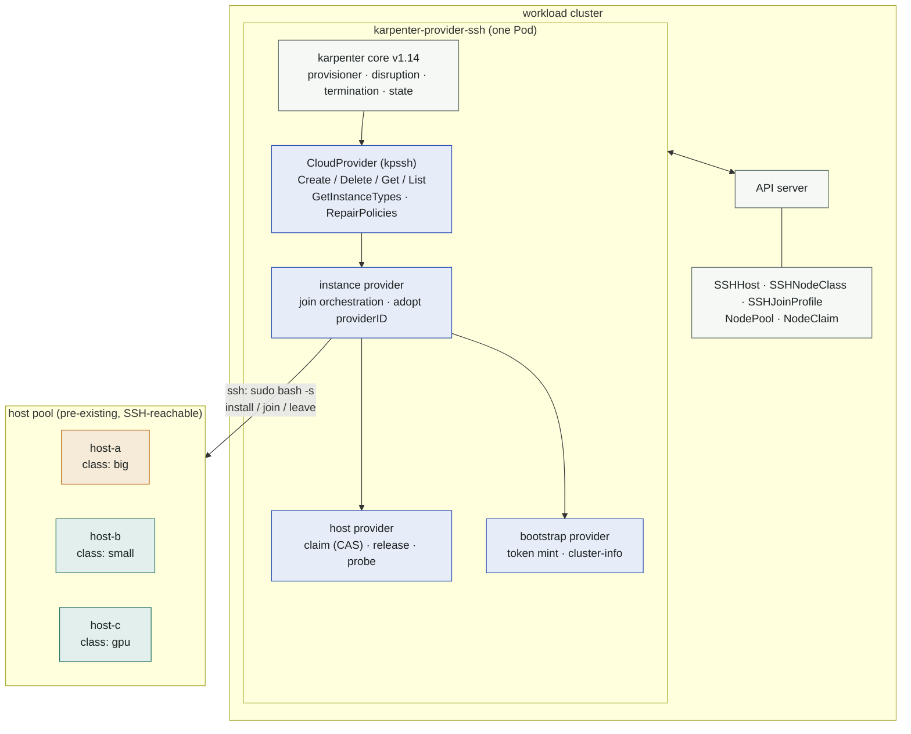
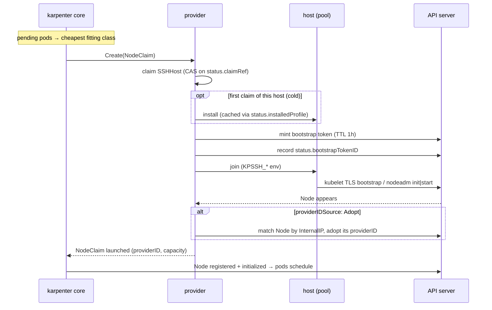
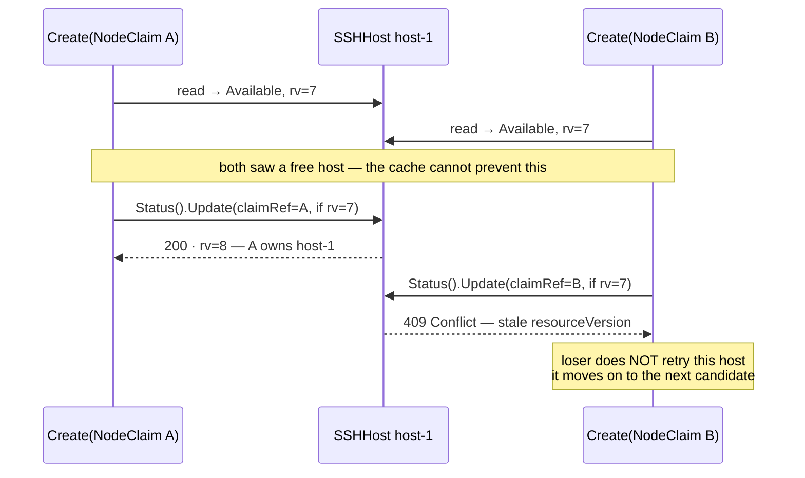
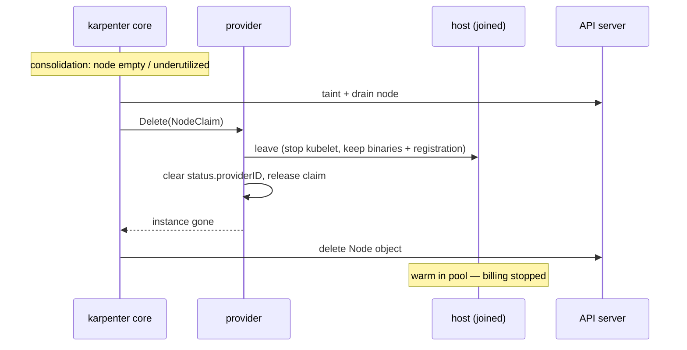
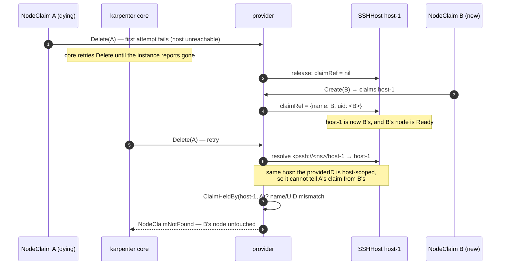
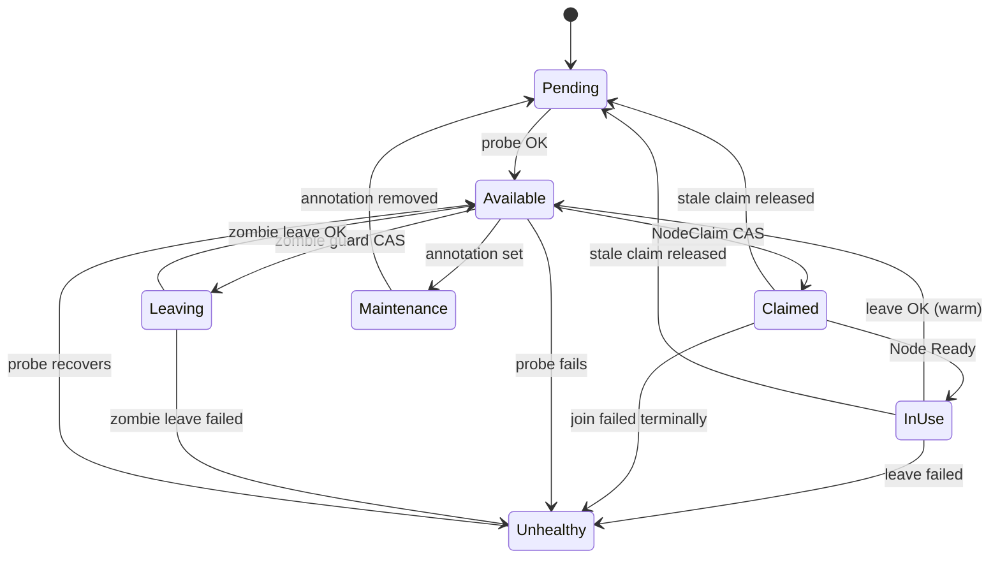

# Architecture

> Why SSH is the transport at all — and why an agent on each host was not
> chosen — is recorded in [ADR 0001](adr/0001-ssh-as-the-transport.md).

One binary, one Deployment. Karpenter core (provisioner, disruption,
termination, state) is compiled in; the provider contributes the
`CloudProvider` implementation plus a small set of controllers around the host
inventory.

## Components

| package | role |
|---|---|
| `pkg/cloudprovider` | karpenter `CloudProvider` interface: NodeClaim → instance mapping, instance types from host classes, ownership gate for coexistence |
| `pkg/providers/host` | SSHHost inventory: list by class/selector, claim via CAS on `status.claimRef`, release, providerID bookkeeping |
| `pkg/providers/instance` | the lifecycle engine: pick cheapest fitting class, claim, run install/join, adopt providerID, leave + release on delete |
| `pkg/providers/instancetype` | one instance type per host class — real capacity, offering priced at `vCPUs × pricePerCPUHour` |
| `pkg/providers/bootstrap` | bootstrap token minting (`cluster-bootstrap`, group `system:bootstrappers:kpssh`, TTL 1 h), token deletion by id + endpoint/CA discovery (`kube-public/cluster-info` or NodeClass override) |
| `pkg/controllers` | `hostprobe` (SSH health probe, capacity/arch observation, stale-claim release, spent-token collection, zombie guard) · `nodeclass` (readiness conditions) |
| `pkg/metrics` | the SSH-facing metric set (probe latency, phase durations, pool gauge, zombie actions) |
| `internal/profile` | Go-template rendering of profile scripts + `KPSSH_*`/`KPSSH_SECRET_*` env assembly, secret redaction, profile validation |
| `internal/sshexec` | SSH transport: TOFU host-key pinning, env preamble injection, `sudo bash -s` |

## Scale-up sequence

The claim is a **compare-and-swap on `SSHHost.status.claimRef`**: whoever
writes their NodeClaim reference first wins; the loser's update fails on
resourceVersion and moves to the next host. One host can never serve two
NodeClaims. `Create` is resumable — if the controller restarts mid-join, the
existing claim is found via `ByClaim` and the join continues (scripts are
idempotent by contract).

The apiserver, not the controller, is the arbiter: the optimistic lock turns a
stale cache read into a **failure**, never a silent overwrite. That is why a
read-then-write over a possibly-stale informer cache is safe here — it fails
closed.

Every other host-status write is a CAS too (optimistic lock on
resourceVersion), not a last-write-wins merge: the claim path, the release path
and the probe controller all drive the same small state machine, and a merge
could resurrect a state another actor just left. Claim and release surface a
lost race to the caller, who re-resolves from scratch; the narrow field setters
(providerID, install marker, token id) retry on a fresh read — but only while
the claim they were issued under still holds, so a host that changed hands
still fails the write.

The bootstrap token is minted after `install` and recorded on the host
(`status.bootstrapTokenID`) *before* `join` runs, so it stays deletable across a
controller crash. The probe controller deletes its Secret as soon as the node
registers — see [security.md](security.md#kubernetes-credentials).

## Scale-down sequence

Ordering matters on EKS: kubelet stops before the Node object goes away,
otherwise kubelet re-creates it (observed live — see concepts.md).

`Delete` is **fenced by NodeClaim identity**, not by providerID alone. A static
providerID is host-scoped (`kpssh://<ns>/<host>` never changes) and karpenter
core retries Delete until the provider reports the instance gone — so a Delete
for a long-dead NodeClaim can still resolve a host that a *successor* claim has
taken. The provider compares the host's `claimRef` (name **and** UID) against
the NodeClaim it was handed, and answers `NodeClaimNotFound` when they differ,
instead of running leave against somebody else's freshly joined node.

Why that is not paranoia — the sequence the fence exists for:

Without the name+UID check, that last retry would run `leave` against a healthy
node that a different NodeClaim owns: kubelet stopped, workloads stranded, and
karpenter told the delete succeeded.

## Host state machine

`Maintenance` and a released stale claim both land on `Pending`, not
`Available` — nothing is claimable until a probe has actually reached it again.
`Maintenance` and `Leaving` are entered from any *unclaimed* state, not only
from `Available`; the diagram draws the common edge.

The probe controller owns `Available ⇄ Unhealthy` (SSH dial + host-key check +
capacity observation) and also releases claims whose NodeClaim no longer
exists. It doubles as the **zombie guard**: an active kubelet on an unclaimed
host that backs a Node of this cluster triggers a forced leave and Node
deletion — the reboot-rejoin failure mode. The guard first CASes the host into
`Leaving`, which fences it against a racing claim while the leave runs.
`Maintenance` is an operator toggle via the
`karpenter.dklesev.github.io/maintenance` annotation.

## Failure model

| failure | handling |
|---|---|
| SSH unreachable | host probes `Unhealthy`, never claimed; karpenter picks another class/host or reports unschedulable |
| join script fails on the host | claim released, host `Unhealthy`, NodeClaim fails → karpenter retries elsewhere |
| profile/nodeclass misconfigured (missing signature, bad secret, template in a verified script) | claim released, host back to `Available` — the host was never touched; the error surfaces on the NodeClaim |
| controller dies mid-join | new leader resumes via existing claim (idempotent scripts) |
| NodeClaim force-deleted | probe controller notices dangling claim, releases host |
| node NotReady 10 min | `RepairPolicies` → karpenter force-terminates the NodeClaim → normal leave path |
| host powered off mid-use | leave fails; host stays `Unhealthy` until probe recovers; Node object still deleted by karpenter |
| warm host reboots and rejoins | profiles prevent it (leave disables kubelet + containerd); if a kubelet still shows up on an unclaimed host, the probe's **zombie guard** re-runs leave, then deletes the zombie Node (kubelet first, or it re-creates the Node) |
| kubelet active on unclaimed host, **and** no Node matches its IP, **and** no install marker | host is parked `Unhealthy` with an explanatory probe error — possibly a foreign cluster's member; the provider never destroys what it cannot attribute |

One placement note: the controller needs SSH reach to the pool hosts, and it
deliberately refuses to run on nodes it manages itself — the chart's default
affinity requires `karpenter.dklesev.github.io/managed` to **not exist** on the
node it lands on. Consolidation must never evict its own controller.

That label is **not written by the controller**. Nothing in the Go code sets it:
it comes from the NodePool template
(`spec.template.metadata.labels`, see `examples/nodepool.yaml`) and karpenter
core syncs it onto the Node at registration. Author a NodePool without it and
the anti-affinity matches nothing — the controller becomes schedulable onto a
pool node, and the first consolidation of that node evicts the very controller
that would have to drain it. Carry the label on every NodePool that references
an SSHNodeClass.
