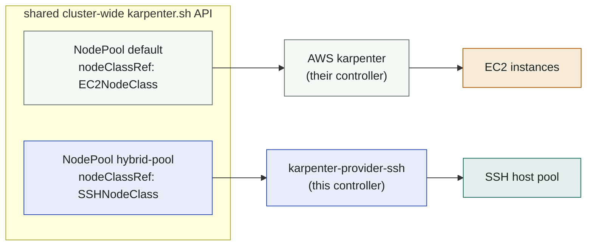

# Coexistence with another karpenter

Clusters that already run a karpenter (EKS with the AWS provider being the
canonical case) can host this provider **alongside it**. Verified live on a
real EKS cluster: the AWS karpenter kept managing its EC2 NodePools while this
provider managed a hybrid-node pool in the same cluster.

## Why it works

Karpenter's multi-provider story hangs on `nodeClassRef`:



- Each controller reconciles only NodePools/NodeClaims whose `nodeClassRef`
  points at a node-class kind it owns (`GetSupportedNodeClasses` +
  `IsManaged`).
- This provider additionally hard-ignores foreign pools in
  `GetInstanceTypes` (guard on `nodeClassRef` group+kind) — karpenter core
  calls it for *every* NodePool (pricing/state controllers), not just owned
  ones. Missing that guard is exactly the kind of bug that only appears on
  shared clusters.
- Nodes are attributed via providerID; `kpssh://` and `aws:///` (and adopted
  `eks-hybrid:///`) never collide.

## The rules

1. **CRDs have one owner.** The existing karpenter owns
   `karpenter.sh` CRDs — never apply, never "upgrade" them from this repo.
   `make install-shared` / the helm chart install only
   `karpenter.dklesev.github.io` CRDs. (`make install` refuses to touch existing
   karpenter.sh CRDs, but don't rely on guardrails — know which cluster type
   you're on.)
2. **Version skew is bounded by the CRD owner.** The shared CRD schema is
   whatever the owning install applied. This provider's library (v1.14.x) must
   be compatible with it — same-minor or ±1 is safe in practice; check
   release notes on larger skews.
3. **Keep workloads from leaking across pools.** The AWS pools are usually
   the default destination; make pool-backed capacity opt-in:

   ```yaml
   # NodePool template (see examples/nodepool-coexist.yaml)
   taints:
     - key: karpenter.dklesev.github.io/pool
       effect: NoSchedule
   ```

   ```yaml
   # consuming workload
   nodeSelector:
     karpenter.sh/nodepool: hybrid-pool
   tolerations:
     - {key: karpenter.dklesev.github.io/pool, operator: Exists, effect: NoSchedule}
   ```

   Without the taint, any pending pod that *fits* a host class may trigger a
   join — the AWS karpenter and this one would both race to offer capacity.
4. **One provider per NodePool.** Don't point two node-class kinds at the same
   NodePool name; create separate pools.
5. **The controller's own placement** must not depend on the pool it manages
   (chicken-and-egg on cold clusters + consolidation would evict it). The
   default anti-affinity keeps it off managed nodes.

## Not two of *this* provider

Coexistence works because the node class **kinds** differ. Two
karpenter-provider-ssh instances in one cluster do **not** coexist, and the
failure is quiet rather than loud.

`GetSupportedNodeClasses` returns `SSHNodeClass` — the kind, not "my
`SSHNodeClass`es". Karpenter core asks each cloudprovider which node classes it
manages and treats every matching NodePool as its own, so with two instances
installed both consider *every* `SSHNodeClass` NodePool theirs, and both
provisioners answer the same pending pod. Separate `poolNamespace` values and
separate leader-election locks do not help: they scope the SSHHost inventory
and the lock, not NodePool ownership.

So: **one instance per cluster**, and it must reach every host it manages.

That reach is a placement question, not a topology one — the controller runs
in-cluster, so a NAT'd or otherwise isolated pool is served by scheduling the
controller *onto a node inside that segment* with `nodeSelector`/`tolerations`.
The pool is then on the LAN and no inbound path from outside is needed. What is
not supported today is a cluster whose pools live in segments that no single
node can reach — that needs sharding, i.e. instance-scoped NodePool ownership.
See [ADR 0001](adr/0001-ssh-as-the-transport.md).

## What you'll see in logs

Healthy coexistence: this provider logs `skipping, nodepool requirements
filtered out all instance types` for foreign pools during provisioning
simulations — that's the ownership filter doing its job, not an error. Foreign
NodePool names in *error*-level pricing/state logs would indicate an ownership
guard regression — report it.
