# Concepts

## Membership is the resource

Classic autoscalers create and destroy **machines**. This provider manages
neither compute nor OS — the hosts already exist (on-prem VMs, bare metal,
long-lived cloud instances). The scalable resource is **cluster membership**:
whether a host currently participates in the cluster as a Node. Pending pods
pull hosts in; karpenter's consolidation pushes idle ones back out.

It is deliberately the low-tech end of autoscaling, for fleets where **SSH is
the only management interface you get**. Where machines can be created on
demand — a cloud API, proxmox, a Cluster API provider — a machine-provisioning
provider is the better fit; use this one when that option does not exist.

```mermaid
gantt
    dateFormat  HH:mm
    axisFormat  %H:%M
    title One host over a day — capacity follows demand
    section host-a
    warm pool           :done, 00:00, 6h
    joined              :active, 06:00, 9h
    warm pool           :done, 15:00, 4h
    joined              :active, 19:00, 2h
    warm pool           :done, 21:00, 3h
```

Why not leave every host attached all the time?

- Detached hosts hold no workloads and take no scheduling decisions — the
  cluster's inventory reflects what is actually in use.
- Karpenter's bin-packing, disruption budgets and consolidation apply to the
  pool with their upstream semantics — attached capacity is always capacity
  something asked for.
- Where attachment itself costs money, membership is the bill.

### The EKS Hybrid Nodes case

> "Billing for hybrid nodes starts when the nodes join the EKS cluster and
> stops when the nodes are removed from the cluster."
> — [EKS Hybrid Nodes overview](https://docs.aws.amazon.com/eks/latest/userguide/hybrid-nodes-overview.html)

$0.02 per vCPU-hour **while attached, idle or not** (first pricing tier, as
listed on [EKS pricing](https://aws.amazon.com/eks/pricing/) in July 2026 —
the rate steps down at higher vCPU volumes, so check yours) — a 64-vCPU host
parked in the cluster costs ~$920/month doing nothing; detached it costs $0. Membership
and billing are the same switch there, which makes this provider's scaling
unit map 1:1 onto the invoice. Two corollaries, both verified live:

1. **Stopping kubelet alone does not stop billing.** A NotReady Node object is
   still "attached". Leave must delete the Node object — and must stop kubelet
   *first*, or kubelet re-creates the Node within its sync interval.
2. **The Node object is the billing switch.** The leave sequence (karpenter
   core drains → the provider's `leave` stops kubelet → core deletes the Node)
   is exactly the sequence that closes the
   billing window.

## Warm pool

`leave` disconnects a host but keeps everything expensive: binaries, container
images, and on EKS the SSM registration (`mi-*` identity). The next join is
therefore *warm* — start kubelet, node Ready in seconds, same identity.

Measured on a real EKS cluster: warm rejoin in **2 seconds**, same `mi-*`, same
providerID, **zero SSM activation registrations consumed**. Activations are
one-time entry tickets needed only for the *first* join of a host (or after
`nodeadm uninstall`); the warm cycle never touches them.

| | cold join | warm join | leave |
|---|---|---|---|
| what runs | `install` + `join` | `join` only | `leave` |
| duration | ~60–90 s (install) + join | seconds–a minute | seconds + drain |
| EKS activation consumed | 1 registration | 0 | 0 |
| when | first claim of a host, or after uninstall | every subsequent claim | every release |

## Host classes = instance types

Hosts carry a class label (`karpenter.dklesev.github.io/host-class`). Each class
becomes one karpenter **instance type** with the class's real capacity and a
price of `vCPUs × pricePerCPUHour`. Karpenter then does what karpenter does:
picks the cheapest fitting class for pending pods and consolidates nodes whose
price is no longer justified. A heterogeneous pool (1c/4G, 2c/16G, 8c/64G+GPU)
behaves like a menu of instance types that happen to be your own hardware.

## Join profiles

*How* a host joins is pluggable and lives in a cluster-scoped
`SSHJoinProfile`: four idempotent scripts (`install`, `join`, `leave`,
`uninstall`) rendered as Go templates and executed over SSH with a defined
[`KPSSH_*` environment](join-profiles.md#environment-contract). The provider
itself is cloud-agnostic — everything EKS-specific lives in the
`nodeadm-ssm` profile, everything SKS/k0s-specific in `tls-bootstrap`.

Credential material that must not live in the provider (e.g. EKS SSM
activation id/code for cold joins) is injected generically from a Secret via
`SSHNodeClass.spec.joinSecretRef`. The provider only reads it at join time —
how that Secret is produced and rotated is outside its scope.

## providerID: static vs adopt

- **static** — the provider owns node identity: `kpssh://<ns>/<host>`, passed
  to kubelet via `--provider-id`. Used by `tls-bootstrap`.
- **adopt** — the join mechanism owns identity (EKS `nodeadm` sets
  `eks-hybrid:///<region>/<cluster>/<mi-*>`). The provider waits for the Node,
  matches it by InternalIP, and adopts its providerID into the NodeClaim.
