# karpenter-provider-ssh

A [Karpenter](https://karpenter.sh) provider that autoscales **cluster
membership of pre-existing hosts** instead of creating machines. When pods are
pending it claims a host from an SSH-reachable pool and joins it to the
cluster; when the node is idle, Karpenter's own consolidation drains it, the
provider disconnects it, and the host returns to a **warm pool**.

It exists for the common on-prem reality where **SSH is all you get**: a
fixed set of VMs or bare-metal machines, no provisioning API. If your
infrastructure can create machines on demand — a cloud API, proxmox, a
Cluster API provider — prefer that dynamic path. The join mechanism is a
pluggable [SSHJoinProfile](join-profiles.md): `tls-bootstrap` works against
any conformant control plane, `nodeadm-ssm` targets **EKS Hybrid Nodes** —
the flagship use case, where attachment itself is billed ($0.02 per vCPU-hour,
idle or not) and membership maps 1:1 onto the invoice.

```mermaid
flowchart LR
    P[pending pods]:::dim --> K["karpenter core<br>(compiled in)"]:::prov
    K -->|NodeClaim| C["claim host<br>CAS lock"]:::prov
    C -->|ssh| J["install¹ + join"]:::prov
    J --> R["Node Ready<br>billing starts"]:::pay
    R -.->|"idle → consolidation"| L[drain + leave]:::pool
    L --> W["host warm in pool<br>billing stopped"]:::pool
    classDef pool fill:#e3efec,stroke:#1d6e5e,color:#1c2422
    classDef pay fill:#f6ead9,stroke:#b35a00,color:#1c2422
    classDef prov fill:#e7ecf9,stroke:#274bb0,color:#1c2422
    classDef dim fill:#f6f8f6,stroke:#5c6b66,color:#1c2422
```

Green is a host costing you nothing, amber is a host on the invoice, blue is
the provider doing work. The same palette is used in every diagram in these
docs.

¹ `install` runs once per host and is cached; every later join is warm.

## Where to start

Reading order for newcomers: **concepts → architecture → installation**.
Operating an install: **api → join-profiles → troubleshooting**.

| document | answers |
|---|---|
| [Concepts](concepts.md) | Why does this exist? What is a warm pool? What exactly is billed on EKS Hybrid? |
| [FAQ](faq.md) | Why not cluster-autoscaler / Cluster API? Does it need EKS? Can it power hosts on? |
| [Architecture](architecture.md) | What runs where? How do karpenter core and the provider interact? What guarantees does the claim lock give? |
| [Installation](installation.md) | How do I install it — greenfield and shared clusters, EKS Hybrid walkthrough, where must the controller run? |
| [API reference](api.md) | Every field of `SSHHost`, `SSHNodeClass`, `SSHJoinProfile`, all labels/annotations/states. |
| [Join profiles](join-profiles.md) | The script contract (`install`/`join`/`leave`/`uninstall`), the `KPSSH_*` environment, shipped profiles, how to write one. |
| [Coexistence](coexistence.md) | Running beside another karpenter (AWS, GCP, …) in the same cluster without stepping on it. |
| [SBC fleets](sbc.md) | Raspberry Pi and other single-board computers as a warm pool — no PXE, no BMC; where power control ends and this provider begins; a kind lab that a real Pi joins. |
| [Security](security.md) | SSH trust (TOFU pinning), what can read which Secret, bootstrap-token scope, RBAC shape, PSS. |
| [Verified execution](verified-exec.md) | Opt-in: signed scripts run via a `ForceCommand` shim; the controller and host both verify. No agent, no Vault. |
| [Operations](operations.md) | Day-2: metrics, host maintenance, capacity drift, probe behavior. |
| [Development](development.md) | Build/test/lint, out-of-cluster runs, the e2e environments, releasing. |
| [Troubleshooting](troubleshooting.md) | Symptom-indexed fixes from real deployments. |
| [Design decisions](adr/README.md) | Why SSH and not an agent, why this API group — and what would change them. |

Related, in the repository:

- [Helm chart values reference](https://github.com/dklesev/karpenter-provider-ssh/blob/main/charts/karpenter-provider-ssh/README.md)
- [Example manifests](https://github.com/dklesev/karpenter-provider-ssh/tree/main/examples) — copy-paste for every object
- [Roadmap](https://github.com/dklesev/karpenter-provider-ssh/blob/main/ROADMAP.md) — what is planned, and what is deliberately not
- [Changelog](https://github.com/dklesev/karpenter-provider-ssh/blob/main/CHANGELOG.md) — release notes
- [Getting help](https://github.com/dklesev/karpenter-provider-ssh/blob/main/SUPPORT.md) · [Contributing](https://github.com/dklesev/karpenter-provider-ssh/blob/main/CONTRIBUTING.md) · [Security policy](https://github.com/dklesev/karpenter-provider-ssh/blob/main/SECURITY.md)
- [Karpenter upstream docs](https://karpenter.sh/docs/) — NodePool/NodeClaim/disruption semantics
