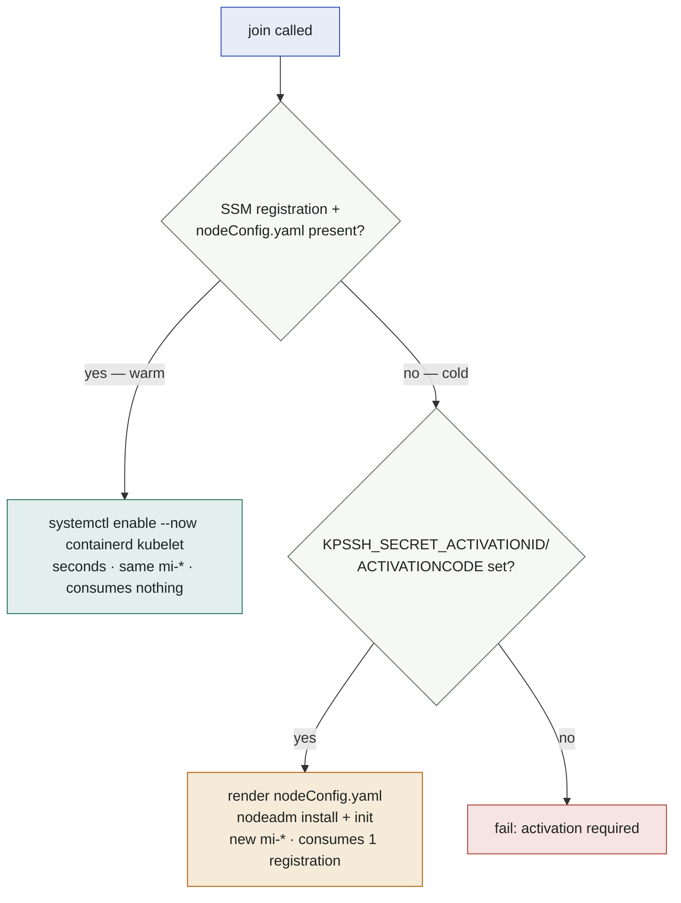

# Join profiles

An `SSHJoinProfile` is the pluggable answer to "how does a host become a
node here". The provider knows nothing about kubeadm, nodeadm, k0s or SKS —
profiles do.

> **Verified execution.** For hosts in `execMode: Verified`, profile scripts are
> signed offline and verified before they run (controller and host both check).
> Those scripts must be **template-free** — all variability arrives as `KPSSH_*`
> env, never `{{ … }}`. See [Verified execution](verified-exec.md).

## Lifecycle contract

| script | when | must be | typical duration |
|---|---|---|---|
| `install` | first claim of a host, or when `<name>@<version>` ≠ `status.installedProfile` | idempotent, heavy OK | 60–90 s |
| `join` | every claim | idempotent, fast | seconds (warm) |
| `leave` | every release | idempotent, fast, **must not destroy installed state** | seconds |
| `uninstall` | never automatically — manual/repair | idempotent | any |

Rules the engine enforces or assumes:

1. **Idempotency is load-bearing.** The controller may re-run any phase after
   a crash/leader change. Scripts must converge, not append.
2. `leave` returns the host to a state where `join` alone reconnects it (the
   warm-pool invariant). Cleaning caches is fine; removing binaries belongs in
   `uninstall`.
3. **`leave` must survive a reboot.** A rebooted warm-pool host must stay out
   of the cluster: `systemctl disable --now` kubelet *and* containerd — a
   merely-stopped-but-enabled kubelet with warm credentials rejoins on boot,
   silently re-opening the billing window. `join` re-enables both. The
   controller's zombie guard catches violations (probe detects a kubelet on an
   unclaimed host and forces a leave), but the profile is the first line.
4. Exit code ≠ 0 fails the phase: a failed `join` releases the claim and marks
   the host `Unhealthy`; karpenter retries elsewhere.
5. **In Raw mode** (the default) scripts run as `sudo bash -s` (or plain
   `bash -s` for `user: root`) with `set -euo pipefail` prepended and the
   environment exported in a preamble.
   **In [Verified mode](verified-exec.md) neither happens**: the shim runs the
   signed bytes exactly as signed — prepending anything would break the very
   signature it just checked — and the environment arrives as validated
   `KPSSH_*` shim params instead of a preamble. A verified script **must carry
   its own `set -euo pipefail`**. Without it a failing command does not abort
   the script, the phase exits 0, and the host is marked joined when it is not.
6. Scripts are ≤ 256 KiB each; `timeouts.*` are Go durations restricted to
   `^([0-9]+(s|m|h))+$` (`90s`, `10m`, `1h30m` — not `1.5h`, not `500ms`).

## The leave contract: empty render context

**`leave` renders with an empty template context. It gets no `.Vars`, no
`.Secrets`, no endpoint, no token — and no `KPSSH_VAR_*` / `KPSSH_SECRET_*`
environment either.**

That is not an oversight. Two paths run `leave` with no node class in hand:

- the **release path** resolves the profile from the host's
  `status.installedProfile` marker, not from a NodeClass;
- the **zombie guard** has no NodeClaim at all — it disconnects a host that
  rejoined on its own.

A `leave` reaching for `{{ .Vars.clusterName }}` therefore fails at exactly the
moment a host must be disconnected — and the guard retries it forever while the
node keeps running (and, on EKS Hybrid, keeps billing).

The node class controller rejects such profiles up front: every SSHNodeClass
referencing them goes `Ready=False` with reason **`ProfileInvalid`**, and
karpenter will not launch against it.

```bash
kubectl get snc -o custom-columns=NAME:.metadata.name,\
READY:'.status.conditions[?(@.type=="Ready")].status',\
REASON:'.status.conditions[?(@.type=="Ready")].reason'
```

The only context `leave` does get is the host's own addressing:
`KPSSH_HOST_ADDRESS` and `KPSSH_NODE_ADDRESS`. Everything a leave needs to
know beyond that must be discoverable **on the host** (`systemctl is-enabled`,
`test -f`, files written by `join`) — which is what an idempotent leave should
be doing anyway.

## Environment contract

| variable | phases | content |
|---|---|---|
| `KPSSH_CLUSTER_ENDPOINT` | install, join | API server URL — NodeClass `cluster.endpoint` override, else `kube-public/cluster-info` |
| `KPSSH_CLUSTER_CA_B64` | install, join | base64 cluster CA (same source) |
| `KPSSH_BOOTSTRAP_TOKEN` | join | fresh bootstrap token, TTL 1 h, group `system:bootstrappers:kpssh`. Recorded on the host (`status.bootstrapTokenID`) and deleted once the node registers |
| `KPSSH_NODE_NAME` | install, join | node name = NodeClaim name (use for `--hostname-override` in `Static` mode) |
| `KPSSH_PROVIDER_ID` | install, join | `kpssh://<ns>/<host>` in `Static` mode; **empty in `Adopt` mode** |
| `KPSSH_HOST_ADDRESS` | install, join, **leave** | the host's SSH address (`spec.address`) — the machine the script is running on, as the controller addresses it |
| `KPSSH_NODE_ADDRESS` | install, join, **leave** | IP the node advertises (`--node-ip`), from `spec.nodeAddress`, else `spec.address` |
| `KPSSH_NODE_LABELS` | install, join | comma-separated `k=v` from the NodeClaim (karpenter-requested labels), filtered to those a kubelet is allowed to self-set. The rest still land on the Node — core syncs all NodeClaim labels at registration |
| `KPSSH_TAINTS` | install, join | `--register-with-taints` value: **always** led by `karpenter.sh/unregistered:NoExecute` (karpenter's registration contract — core removes it after syncing labels/taints), then the NodeClaim taints (`key=value:Effect`, comma-separated). Profiles MUST pass it to the kubelet |
| `KPSSH_VAR_<KEY>` | install, join | every `SSHNodeClass.spec.vars` entry |
| `KPSSH_SECRET_<KEY>` | install, join | every `joinSecretRef` Secret data key, uppercased, `-` and `.` → `_` |

`leave` sees only the two address variables (above); the other fixed names are
exported but empty, and `KPSSH_VAR_*`/`KPSSH_SECRET_*` are absent entirely.
`uninstall` is never executed by the controller.

Everything is also available as Go-template data at render time; prefer env in
scripts (works under `bash -s`, easier to test by hand).

## Shipped profiles

### `tls-bootstrap` ([examples/profile-tls-bootstrap.yaml](https://github.com/dklesev/karpenter-provider-ssh/blob/main/examples/profile-tls-bootstrap.yaml))

Generic kubelet TLS bootstrapping against any conformant control plane.
Verified: kind (the in-repo e2e — `join`/`leave` run verbatim; `install` is
stubbed there, because a `kindest/node` host already has kubelet), k0s,
Exoscale SKS (unofficial but working).

- `install`: containerd + kubelet + CNI plugins for the host's arch
- `join`: writes bootstrap kubeconfig from `KPSSH_BOOTSTRAP_TOKEN` +
  endpoint/CA, starts kubelet with `--provider-id`, `--node-ip`,
  `--hostname-override`
- `leave`: disables + stops kubelet and containerd, kills workload shims,
  wipes membership state + CNI devices, keeps binaries
- vars: `k8sMinor` (**required**, must match the control plane),
  `clusterDNS` (default `10.96.0.10`), `serverTLSBootstrap` (`"true"` when a
  kubelet-serving CSR approver runs — needed for `kubectl top`/metrics-server
  with kubelet CA verification)

Cluster-side requirements: bind group `system:bootstrappers:kpssh` to
`system:node-bootstrapper` + client-CSR auto-approval —
[examples/bootstrap-rbac.yaml](https://github.com/dklesev/karpenter-provider-ssh/blob/main/examples/bootstrap-rbac.yaml) is the
copy-paste version.

### `nodeadm-ssm` ([examples/profile-nodeadm-ssm.yaml](https://github.com/dklesev/karpenter-provider-ssh/blob/main/examples/profile-nodeadm-ssm.yaml))

EKS Hybrid Nodes via `nodeadm` with the SSM credential provider. Verified live
on a real EKS 1.34 cluster. Implements the warm/cold split that makes the
billing model work:



- `leave`: `systemctl disable --now kubelet containerd` and nothing else — the
  SSM registration is the durable node identity; destroying it would turn
  every rejoin cold. Disabling (not just stopping) keeps a rebooted host out
  of the cluster
- `uninstall`: `nodeadm uninstall` (kills registration; next join needs a
  valid activation and mints a new `mi-*`)
- vars: `clusterName`, `region`, `k8sVersion`
- pair with `providerIDSource: Adopt` — nodeadm owns the providerID
  (`eks-hybrid:///…/mi-*`); the provider adopts it by InternalIP match

Activation credentials come from `joinSecretRef` — the provider stays
AWS-free and only reads the Secret at join time; producing and rotating it is
outside its scope.

Do not xtrace secrets: `set -x` prints commands after expansion, so a
`: "${KPSSH_SECRET_ACTIVATIONID:?}"` check or a heredoc that interpolates
`KPSSH_SECRET_*` echoes the value to stderr, which the controller relays into
its logs. The shipped `join` runs the activation checks and the `nodeConfig.yaml`
heredoc without `-x` and switches tracing on only afterwards. Follow the same
rule in your own profiles for every `KPSSH_SECRET_*` value.

### `sbc` ([examples/sbc/profile-sbc.yaml](https://github.com/dklesev/karpenter-provider-ssh/blob/main/examples/sbc/profile-sbc.yaml))

`tls-bootstrap` for Debian-family single-board computers (Raspberry Pi OS,
Armbian, Ubuntu for Pi): memory-cgroup guard, skip-apt-when-current, Debian's
containerd CNI path, kubeadm drop-in ordering. Verified on a Raspberry Pi 4 —
the walkthrough, the board-prep half, and the measured join/leave numbers are
in [SBC fleets](sbc.md).

## Writing your own profile

1. Start from `tls-bootstrap` and keep the phase semantics table above next to
   you.
2. Make every script converge: `command -v`, `test -f`, `systemctl is-active`
   guards before every mutation.
3. Put mechanism config into `vars`, credentials into `joinSecretRef` — never
   inline secrets into scripts (they land in the CR, in etcd, in `kubectl get
   -o yaml`).
4. Decide identity: if your mechanism sets a providerID itself, document
   `providerIDSource: Adopt`; otherwise consume `KPSSH_PROVIDER_ID`.
5. Test each phase by hand first — the env preamble makes that trivial:

   ```bash
   ssh host 'sudo env KPSSH_CLUSTER_ENDPOINT=… KPSSH_BOOTSTRAP_TOKEN=… bash -s' < join.sh
   ```

6. Bump `spec.version` whenever `install` changes behavior — that is the only
   cache invalidation.
7. Mind the leave/uninstall split: `leave` runs on every scale-down and must
   keep the warm-pool invariant; destructive cleanup goes to `uninstall`.
8. Keep `leave` self-contained — no `.Vars`, no `.Secrets`, no template data
   beyond the host's addresses ([contract](#the-leave-contract-empty-render-context)).
   A profile that breaks this is rejected: every SSHNodeClass using it reports
   `Ready=False` / `ProfileInvalid` and karpenter stops launching against it.
