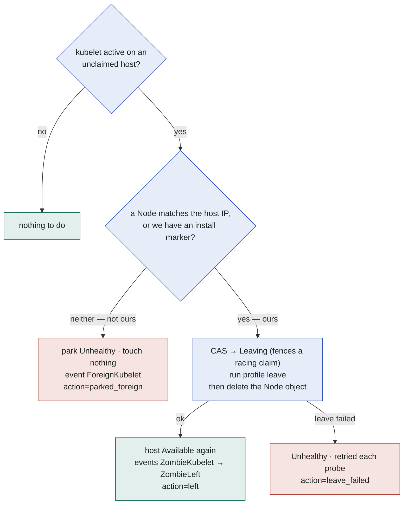

# Operations

## Metrics

The controller serves Prometheus metrics on karpenter's metrics endpoint
(`METRICS_PORT`, default 8080); the chart ships a `ServiceMonitor`
(`serviceMonitor.enabled=true`). Karpenter core publishes its own scheduling
and disruption metrics; the provider adds the SSH-facing view:

| metric | type | labels | meaning |
|---|---|---|---|
| `kpssh_pool_hosts` | gauge | `state`, `class` | pool inventory by lifecycle state and host class, computed on scrape from the controller cache |
| `kpssh_host_probe_duration_seconds` | histogram | `outcome` | SSH host probe latency (`success`/`error`) |
| `kpssh_instance_phase_duration_seconds` | histogram | `phase`, `outcome` | profile script phases over SSH (`install`, `join`, `leave`) |
| `kpssh_host_zombie_actions_total` | counter | `action` | zombie guard interventions: `left`, `parked_foreign`, `leave_failed` |

Useful starting points:

```promql
# pool headroom per class
sum by (class) (kpssh_pool_hosts{state="Available"})

# join latency p95
histogram_quantile(0.95, sum by (le) (rate(kpssh_instance_phase_duration_seconds_bucket{phase="join"}[15m])))

# hosts the probe cannot reach
sum(kpssh_pool_hosts{state="Unhealthy"})

# reboot-rejoin incidents (should be rare — alert on it)
increase(kpssh_host_zombie_actions_total[1h])
```

## Host maintenance

Taking a host out of the pool — kernel upgrade, disk swap, firmware, moving the
machine — is one annotation. Its **presence** is the switch; the value is
ignored.

```bash
# 1. park the host: it is no longer claimable, immediately
kubectl -n kpssh-system annotate sshhost host-a \
  karpenter.dklesev.github.io/maintenance=true

# 2. if it is currently joined (InUse), evict it through karpenter — that runs
#    the normal drain + leave, so the warm-pool invariant holds
claim=$(kubectl -n kpssh-system get sshhost host-a -o jsonpath='{.status.claimRef.name}')
[ -n "$claim" ] && kubectl delete nodeclaim "$claim"

# 3. the host lands in Maintenance and stays there — no probes, no claims
kubectl -n kpssh-system get sshhost host-a
# NAME     ADDRESS     CLASS   STATE         CLAIM   INSTALLED
# host-a   10.0.0.11   big     Maintenance

#    …do the work: reboot it, rebuild it, unplug it…

# 4. hand it back
kubectl -n kpssh-system annotate sshhost host-a \
  karpenter.dklesev.github.io/maintenance-
# state → Pending → (probe) → Available
```

Details worth knowing:

- **The annotation parks, it does not evict.** A `Claimed`/`InUse` host keeps
  serving its NodeClaim: the state only flips to `Maintenance` once the claim is
  gone (step 2, or ordinary consolidation). The claim path honors the annotation
  from the moment it is set, though — an annotated host is never handed out
  again, not even in the window before the state catches up.
- **A `Maintenance` host is not probed.** It is expected to be down. Its
  `lastProbeTime` freezes; nothing alerts. Removing the annotation moves it to
  `Pending` and the next probe decides `Available` vs `Unhealthy`.
- **Rebuilt the host from scratch?** Its install cache
  (`status.installedProfile`) and host key are stale. Clear the marker so the
  next claim re-runs `install`, and clear the fingerprint so TOFU re-pins:

  ```bash
  kubectl -n kpssh-system patch sshhost host-a --subresource=status --type=merge \
    -p '{"status":{"installedProfile":"","hostKeyFingerprint":""}}'
  ```

  Simply deleting and recreating the SSHHost does the same and is less fiddly —
  it is also the only way to change `spec.address`, which is immutable.
- **Draining the whole pool** (site maintenance): annotate every host, then
  scale the demand to zero and let consolidation return them. Karpenter's
  disruption budgets on the NodePool still apply.

## Probe behavior

The hostprobe controller is the pool's only source of truth about hosts.
Every `probeInterval` it opens an SSH connection to each unclaimed host and runs
four commands — `nproc`, `MemTotal` from `/proc/meminfo`, `uname -m`,
`systemctl is-active kubelet` — from which it derives capacity, architecture,
health, and whether a kubelet is running where none should be.

| knob | value | meaning |
|---|---|---|
| probe interval | **2 min** | per host, when unclaimed (`Pending`, `Available`, `Unhealthy`, `Leaving`) |
| probe timeout | **30 s** | SSH dial + script; exceeding it marks the host `Unhealthy` |
| claimed recheck | **5 min** | `Claimed`/`InUse` hosts are **not** probed — the join path owns the SSH connection, and node health is karpenter's job (`RepairPolicies`). They are only rechecked for a stale claim |
| token recheck | **30 s** | while a claimed host still holds an unspent bootstrap token, until its node registers |
| conflict retry | **1 s** | after losing an optimistic-lock race on a status write |
| concurrency | **8** | parallel reconciles. Probes block on SSH, so a single dead host must not stall the rest of the pool |

**Staleness guard.** Each probe writes status, each status write re-triggers the
controller through its own watch. Without a guard that is a hot loop, not a
2-minute interval — so a reconcile that finds `observedGeneration ==
metadata.generation` and a `lastProbeTime` newer than the interval skips the
probe and requeues for the remainder. The generation comparison is the escape
hatch: **editing an SSHHost's spec probes it immediately** instead of waiting up
to 2 minutes.

**Zombie guard.** A kubelet found running on an *unclaimed* host is a membership
nobody is paying attention to — classically a reboot restarting an enabled
kubelet with warm credentials, which silently re-opens the EKS Hybrid billing
window. The probe reacts:



Order matters in the "ours" branch: kubelet is stopped **before** the Node is
deleted, or it simply re-registers. Both conditions are required to call a host
foreign — a host with a matching Node is force-left whether or not it carries an
install marker. The counter is `kpssh_host_zombie_actions_total{action=…}`.

Any zombie action is a bug in a profile's `leave` (it did not `systemctl disable`
kubelet *and* containerd) — alert on the counter and fix the profile.

**Stale claims.** A `Claimed`/`InUse` host whose NodeClaim no longer exists — or
whose NodeClaim name was reused by a different object (UID mismatch) — is
released back to `Pending`, its bootstrap token deleted. That is the repair path
for a force-deleted NodeClaim (finalizers stripped by hand).

## Bootstrap tokens

The kubelet bootstrap token minted for a join is recorded on the host as
`status.bootstrapTokenID` before the join runs, and its Secret in `kube-system`
is deleted as soon as the node registers (the kubelet holds a client certificate
by then), or on release / stale-claim if the join never got that far.

```bash
# tokens in flight right now (should be empty in a settled cluster)
kubectl -n kpssh-system get sshhosts \
  -o custom-columns=NAME:.metadata.name,TOKEN:.status.bootstrapTokenID

# what the provider left behind in kube-system (should be nothing but other
# people's tokens)
kubectl -n kube-system get secrets --field-selector type=bootstrap.kubernetes.io/token
```

This collection matters because nothing else does it: upstream's
`tokencleaner` controller is disabled by default, so an uncollected token
Secret would outlive its TTL in `kube-system` forever. If you see tokens
described `karpenter-provider-ssh nodeclaim …` outliving their 1 h TTL, the
controller lost its record of them (crash before the id was written) — they
are inert, but safe to delete by hand.

## Host classes and capacity

A host class (`karpenter.dklesev.github.io/host-class`) is one karpenter instance
type. Three rules the controller enforces, all of which bite a heterogeneous
pool:

- **One architecture per class.** A class whose hosts report different
  `status.observedArch` is **skipped entirely** — not advertised, never
  claimable — with an error in the controller log. Any host of a class can
  answer a claim, so a single advertised arch would let karpenter schedule
  `arm64` images onto an `amd64` host. Split them: `bm-large-amd64`,
  `bm-large-arm64`.
- **The class advertises the per-resource minimum across its hosts.** Mix an
  8-CPU and a 4-CPU host in one class and the class is a 4-CPU instance type —
  karpenter bin-packs against what the *smallest* member can deliver, because it
  cannot know which one will answer. A resource only some hosts declare (a GPU)
  is dropped from the class entirely.
- **Unlabeled hosts land in the class `default`.** Consistently: instance types,
  claim matching and metrics all agree on it, so a host with no class label is
  claimable rather than advertised-but-unusable.

A class with no probed host yet (no `observedArch`) is not advertised at all —
which is why a brand-new pool briefly reports no instance types.

```bash
# what karpenter actually sees, per class
kubectl -n kpssh-system get sshhosts \
  -o custom-columns=NAME:.metadata.name,\
CLASS:'.metadata.labels.karpenter\.dklesev\.github\.io/host-class',\
ARCH:.status.observedArch,STATE:.status.state,CPU:'.spec.capacity.cpu',MEM:'.spec.capacity.memory'
```

## Drift: rolling nodes on profile or nodeclass changes

Bumping `SSHJoinProfile.spec.version` invalidates the install cache for new
joins **and** marks every joined node whose host carries an older
`installedProfile` marker as drifted (`ProfileDrift`). Karpenter's drift
disruption then replaces those nodes at the pace your NodePool's
`disruption` budgets allow; each replacement re-runs the install phase with
the new profile.

Editing an SSHNodeClass's join-affecting fields (`vars`, `joinSecretRef`,
`providerIDSource`, `cluster`) drifts existing nodes the same way
(`NodeClassDrift`, via the `nodeclass-hash` annotation stamped on each
NodeClaim at create). Scheduling-model fields (`hostSelector`,
`pricePerCPUHour`, `kubeReserved`, `maxPods`) never roll nodes.

```bash
# roll all nodes of a profile through the new install
kubectl patch sshjoinprofile tls-bootstrap --type merge -p '{"spec":{"version":"2"}}'
kubectl get nodeclaims -o wide   # watch Drifted=true → replacement
```

Script edits without a version bump do NOT roll anything — existing installs
stay cached, only fresh installs pick the new scripts. That is deliberate:
the version field is the operator's explicit rollout trigger.

## Events

The provider emits Kubernetes events for operational visibility:

| object | reason | meaning |
|---|---|---|
| NodeClaim | `JoinFailed` / `AdoptFailed` / `CreateFailed` | why a claim could not become a node |
| SSHHost | `CapacityDrift` | probed capacity fell below `spec.capacity` |
| SSHHost | `ZombieKubelet` / `ZombieLeft` | zombie guard detected / disconnected a stray membership |
| SSHHost | `ForeignKubelet` | kubelet on a host this provider never installed — parked, never touched |
