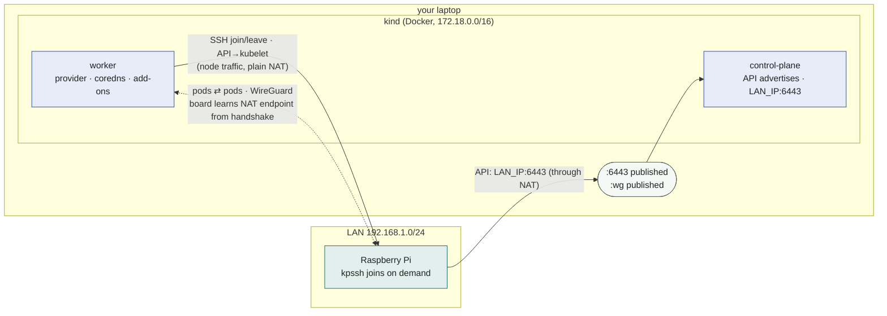

# Single-board computers — Raspberry Pi and friends

A fleet of boards you imaged once, that sit powered somewhere (or get powered
by something of yours), and that should be cluster members only while pods
need them. No PXE, no BMC, no machine API — an SD card with an OS and `sshd`,
which is exactly the contract this provider was built for. This page is the
Raspberry Pi walkthrough: what a board needs, where power control ends and
this provider begins, the shipped profile and manifests, and a kind lab on a
laptop that a real Pi 4 joined while these numbers were measured.

Everything referenced lives in
[examples/sbc/](https://github.com/dklesev/karpenter-provider-ssh/tree/main/examples/sbc).

## Why boards are this provider's case

Every machine-provisioning path assumes something a board does not offer:

| tool | assumes | a board offers |
|---|---|---|
| Cluster API bare-metal, MAAS, Tinkerbell | PXE/iPXE or a BMC to image the machine and control its power | an SD card you flashed with Raspberry Pi Imager; a power supply |
| cloud / proxmox / VM providers | an API that creates machines | nothing creates a Pi |
| cluster-autoscaler | a node group it can add members to | a fixed set of boards that already exist |

What a board does have is a running OS, a network path, and `sshd` — so the
scalable resource is **membership**: the board joins when a pod needs it and
leaves when the pod is gone, keeping binaries and images for the next time
([Concepts](concepts.md)). The same shape covers more than Pis:

- **arm64 SBCs** — Raspberry Pi 4/5, Compute Module carriers, Rock 5, Orange
  Pi, Odroid: this page, unchanged.
- **NVIDIA Jetson** — arm64 + Ubuntu/JetPack; add the NVIDIA container runtime
  and device plugin in a profile variant and declare `nvidia.com/gpu` in
  `SSHHost.spec.capacity` (the device-plugin path in the [FAQ](faq.md#does-it-support-dra-dynamic-resource-allocation)).
- **x86 mini PCs, thin clients, industrial PCs** — amd64; same profile
  (Debian-family), and they usually *do* have Wake-on-LAN, which makes the
  power question below cheap.
- **machines with a day job** — a kiosk, a vehicle's onboard computer, a
  bench controller: the board runs its own workload and lends its CPU to the
  cluster on demand. Taint the pool so only what tolerates it lands there.

Hard requirements: a 64-bit Linux (`kubernetes.io/arch` is `amd64` or `arm64`
— the provider advertises nothing else), systemd, apt for the shipped profile,
realistically ≥ 2 GB RAM (kubelet + containerd + a CNI agent take 500–700 MB
before the first pod), a login with passwordless sudo, SSH reach **from where
the controller runs**, and reach from the board to the API endpoint.

## Power is not this provider's job

The provider never powers anything. Its contract starts at *powered on, OS
booted, sshd answering*; how the board got there is yours. An off board is
`Unhealthy` after its next probe (2 min interval, 30 s dial timeout —
[Operations](operations.md#probe-behavior)), never claimed, and re-admits
itself on the first successful probe after it boots. Nothing needs to be told.

That fits boards, because for boards power control is rarely worth automating:

| mechanism | boards | notes |
|---|---|---|
| **leave it on** | all | a Pi 4 idles at 3–4 W ≈ €10/year. The thing worth scaling is membership (control-plane cost, EKS Hybrid billing, attack surface, disruption budgets) — not watts. This is the default and the reason the pool is *warm* |
| PoE switch port | Pi 4/5 with PoE HAT, many industrial boards | the fleet-grade answer: 802.3af/at port power via the switch's API/CLI/SNMP (UniFi, MikroTik, Cisco). One power controller for the rack |
| smart plug / PDU | any | Shelly/Tasmota HTTP, a PDU's SNMP |
| RTC alarm | Pi 5 | `/sys/class/rtc/rtc0/wakealarm` + `POWER_OFF_ON_HALT=1` in the EEPROM config: halt into µW, wake at a time |
| GPIO wake | Pi 4/5 | `WAKE_ON_GPIO=1` (EEPROM default): a short on GPIO3 wakes a halted board — a button, or a relay driven by something else |
| Wake-on-LAN, AMT | x86 boards | **not** the Pi's onboard NIC |
| BMC / Redfish / IPMI | servers | then you have a provisioning API and [should use it](faq.md#why-not-cluster-api-maas-tinkerbell-or-a-cloud-provider) |

Whatever you pick composes with the provider from the outside. Two rules keep
it clean:

**Powering off:** park the board first, then cut. Cutting power to an `InUse`
board is a node failure — karpenter tolerates NotReady for 10 min before repair,
the workload is disrupted, the leave runs against a dead host and fails, the
board parks `Unhealthy` and only the zombie guard sorts it out after the next
boot (the power-outage e2e scenario proves exactly that recovery; it is not
how you want to run a Tuesday).

```bash
# 1. no new claims from now on; a joined board is evicted through karpenter
kubectl -n kpssh-system annotate sshhost rpi-01 karpenter.dklesev.github.io/maintenance=true
claim=$(kubectl -n kpssh-system get sshhost rpi-01 -o jsonpath='{.status.claimRef.name}')
[ -n "$claim" ] && kubectl delete nodeclaim "$claim"        # drain → leave → Available
# 2. wait for the park, then shut down cleanly and cut power
kubectl -n kpssh-system wait sshhost rpi-01 --for=jsonpath='{.status.state}'=Maintenance --timeout=10m
ssh kpssh@192.168.1.216 sudo systemctl poweroff
curl -s http://poe-switch/api/port/7/power/off                  # whatever yours is
```

**Powering on:** the reverse — power, wait for sshd, hand the board back.
Without the annotation, a board that simply reappears goes `Unhealthy →
Available` by itself on the next probe; the annotation only matters if you
parked it.

```bash
curl -s http://poe-switch/api/port/7/power/on
until ssh -o ConnectTimeout=3 kpssh@192.168.1.216 true 2>/dev/null; do sleep 5; done   # Pi 4: ~30 s
kubectl -n kpssh-system annotate sshhost rpi-01 karpenter.dklesev.github.io/maintenance-
# Pending → probe → Available; karpenter sees the class grow
```

Run those from a CronJob, your home automation, or by hand before a demo. What
the provider will not do — and [does not plan to](https://github.com/dklesev/karpenter-provider-ssh/blob/main/ROADMAP.md)
— is power a board on *because* a pod is pending: that needs a power API in the
claim path, and the boards where it would pay off are the ones that cost cents
to leave running.

## Preparing a board

Four things the profile cannot do for itself; everything else (containerd,
kubelet, CNI plugins, sysctls) is the profile's `install` phase, cached per
board.

1. **A pool login.** A dedicated user, your pool public key, passwordless sudo
   — the provider runs profiles as `sudo bash -s` ([Security](security.md)).
2. **The memory cgroup controller.** Raspberry Pi OS boots with it **off**
   (`cgroup_disable=memory` is injected by the firmware); kubelet and runc need
   it. `cgroup_enable=cpuset cgroup_enable=memory cgroup_memory=1` in
   `cmdline.txt` and one reboot. The profile refuses to install without it,
   with a message that says so.
3. **Wi-Fi power save off**, if the board is on Wi-Fi. The Pi's `brcmfmac`
   enables 802.11 power save by itself (`dmesg`: `brcmf_cfg80211_set_power_mgmt:
   power save enabled`); on a busy channel the board then misses beacons, drops
   off the network after idle minutes, and eventually the SDIO firmware wedges
   until a reboot. That is a node that vanishes. `wifi.powersave = 2` in a
   NetworkManager `conf.d` drop-in fixes it persistently (the reference Pi lost
   SSH twice in ten minutes before this, zero drops in the hours after).
4. **Swap off** — swapping onto an SD card is worse than the OOM killer.

Two ways to get there, same result:

```bash
# an already-running board, over the login you have
ssh-keygen -t ed25519 -N '' -f pool_ed25519
ssh pi@192.168.1.216 "sudo env KPSSH_PUBKEY='$(cat pool_ed25519.pub)' bash -s" < examples/sbc/prep-host.sh
#   kpssh prep: OK
#     SSHHost spec.user:      kpssh
#     SSHHost spec.address:   192.168.1.216   (reserve it in DHCP — the field is immutable)
#     arch:                   aarch64
#     SSHHost spec.capacity:  cpu "4", memory ≤ 3795Mi (probe-observed; keep headroom, e.g. 3415Mi)
#     REBOOT REQUIRED: memory cgroup enabled in /boot/firmware/cmdline.txt …
```

or at image time: Raspberry Pi OS boots with cloud-init, and Raspberry Pi
Imager writes `user-data` onto the boot partition — merge
[cloud-init.yaml](https://github.com/dklesev/karpenter-provider-ssh/blob/main/examples/sbc/cloud-init.yaml)
into it before the first boot (`users: [default, …]` keeps the user Imager
configured; `power_state` reboots once at the end of the first boot for the
cgroup). Flash twenty cards, they all come up prepared.

Fleet hygiene that costs nothing now and a lot later:

- **DHCP reservations.** `SSHHost.spec.address` is immutable and the zombie
  guard matches it against the Node's InternalIP; a board that re-leases a
  different address is a new SSHHost. Reserve by MAC.
- Node names are NodeClaim names (`edge-abc12`), not hostnames — name the
  boards whatever you like.
- **Pre-bake if the first claim must be fast.** The profile skips apt when
  kubelet already matches `k8sMinor`; run its package steps at image time and a
  fresh board installs in seconds instead of minutes.

## The `sbc` profile

[profile-sbc.yaml](https://github.com/dklesev/karpenter-provider-ssh/blob/main/examples/sbc/profile-sbc.yaml)
is `tls-bootstrap` with the things Debian-family boards need. Each is a trap
that was hit, not a preference:

| change | why |
|---|---|
| `install` fails without the memory cgroup controller | the fix is a reboot; a join must not do that. The error message names `prep-host.sh` |
| apt only when kubelet is missing or on the wrong minor | apt onto an SD card over Wi-Fi is the slow part of a cold join; a pre-baked board should not pay it. `--allow-downgrades` covers a board imaged with a newer kubelet than the control plane |
| containerd from the distro, `bin_dir` repointed at `/opt/cni/bin` | Debian patches its containerd default to `/usr/lib/cni`; `kubernetes-cni` and every CNI DaemonSet (cilium, flannel, …) install to `/opt/cni/bin`. Without the sed, pods hang in `ContainerCreating` with *failed to find plugin* |
| `--node-ip` only for an IP literal | kubelet rejects names; a board addressed by DNS gets kubelet's own detection (and should set `spec.nodeAddress`, [api.md](api.md#sshhost-namespaced-kubectl-get-sshhosts)) |
| kubelet drop-in named `90-kpssh.conf` | systemd applies drop-ins in filename order across `/usr/lib` and `/etc`; the `kubeadm` package ships `10-kubeadm.conf` with its own `ExecStart=`. A `10-kpssh.conf` sorts *before* it and loses — kubelet then starts with kubeadm's flags and an absent config. Boards imaged with kubeadm (every Pi tutorial) hit this |
| `leave` keeps `cilium_wg0` | with Cilium *node* encryption (a common setting, not the shipped lab values) the controller's SSH session rides that tunnel while the board is a member; deleting the device mid-script cuts the session and the phase reports *remote command exited without exit status*. Observed live — the board was left correctly, the report was wrong |

Vars: `k8sMinor` (required, must match the control plane), `clusterDNS`
(default `10.96.0.10`), `serverTLSBootstrap` (`"true"` with a kubelet-serving
CSR approver). Template-free, so it signs unchanged for
[verified execution](verified-exec.md).

## The manifests

- **[host-rpi.yaml](https://github.com/dklesev/karpenter-provider-ssh/blob/main/examples/sbc/host-rpi.yaml)** —
  one `SSHHost` per board, class label = board model (`rpi4`, `rpi5`). A class
  advertises the *smallest* capacity among its members and must be single-arch
  ([Operations](operations.md#host-classes-and-capacity)) — a Pi 4 and a Pi 5
  are two classes, karpenter picks the cheaper one that fits. Capacity at or
  below the probe's numbers: a 4 GB Pi 4 reports `3886904Ki`; `3500Mi` leaves
  headroom and never trips `CapacityDrift`.
- **[nodeclass-sbc.yaml](https://github.com/dklesev/karpenter-provider-ssh/blob/main/examples/sbc/nodeclass-sbc.yaml)** —
  profile, vars, and a price that is at least honest: a Pi 4 at ~5 W and
  €0.30/kWh is about €0.0004 per vCPU-hour. The price ranks classes and feeds
  consolidation; it is not a bill. Endpoint and CA come from
  `kube-public/cluster-info`; set `spec.cluster` only when that names
  something the boards cannot reach (a private name, an EKS endpoint outside
  `kube-public` — [api.md](api.md#sshnodeclass-cluster-scoped-kubectl-get-snc)).
- **[nodepool-edge.yaml](https://github.com/dklesev/karpenter-provider-ssh/blob/main/examples/sbc/nodepool-edge.yaml)** —
  arm64 requirement, the `karpenter.dklesev.github.io/pool` taint so nothing
  lands on a board unless it asks to, `consolidateAfter: 5m` because boards
  pull images slowly and must not flap, `expireAfter: Never`, limits = the
  real pool.
- **[workload.yaml](https://github.com/dklesev/karpenter-provider-ssh/blob/main/examples/sbc/workload.yaml)** —
  demand only a board can serve, and every 30 s a line that proves the node
  is a real member: cluster DNS resolves and the API answers through its
  ClusterIP, both of which cross to the control plane's nodes.

## A lab on your laptop that a real Pi joins

The pool does not care what the control plane is: k3s or kubeadm on a Linux
box or a second Pi, Exoscale SKS, EKS Hybrid — anything the boards can route
to, with its stock CNI. A laptop is different: **kind's nodes are Docker
containers behind Docker Desktop's NAT.** A board can reach your laptop's
published API port and nothing else; every in-cluster address a plain CNI
hands the board — the `kubernetes` ClusterIP's endpoint, kube-proxy's
kubeconfig, a VXLAN peer — points at `172.18.0.x`. VXLAN cannot fix that: it
is stateless and would send to the container IP forever.



Two files make the boards' view of the cluster consistent:

- **[kind-config.yaml](https://github.com/dklesev/karpenter-provider-ssh/blob/main/examples/sbc/kind-config.yaml)**
  — one control plane, one worker, and two kubeadm patches: the API server
  **advertises the laptop address** (`controlPlaneEndpoint` and
  `advertise-address` = `${LAN_IP}`). The `kubernetes` ClusterIP's endpoint
  and `kube-public/cluster-info` then name `192.168.1.187:6443`, which a
  board's pods reach through the published port — and kind's own pods reach
  through Docker's hairpin. Without this a board's pods resolve DNS and never
  reach the API: their `kubernetes.default` connection is DNAT'd to the
  control-plane container's IP and dies in the NAT. It also makes cluster-info
  usable, so the NodeClass needs no `spec.cluster` override.
- **[cilium-values.yaml](https://github.com/dklesev/karpenter-provider-ssh/blob/main/examples/sbc/cilium-values.yaml)**
  — **WireGuard** carries what remains. Pod ⇄ pod across the NAT (coredns on
  a kind node answering a board's pod): the kind side can reach a board and
  initiates; the board learns the laptop's NAT endpoint from the handshake
  (`wg show cilium_wg0` on the board: `endpoint: 192.168.1.187:48411`) and
  the 25 s keepalive holds it. And — less obvious — the provider's own SSH
  once the board is a member: Cilium never masquerades pod traffic to
  *cluster node* IPs, so with node encryption off the controller's `leave`
  dial leaves Docker with a pod source address and dies in the NAT (observed:
  every join fine, every leave `dial … i/o timeout`, because at join time the
  board still counts as `world` and gets SNATed). `nodeEncryption: true`
  sends it through the tunnel instead; Cilium's default control-plane opt-out
  stays, since the API advertises the laptop address and the control plane's
  own host traffic is masqueraded by Docker. Agents talk to the API at the
  laptop address (`k8sServiceHost`) with kube-proxy replacement. The per-node
  Envoy DaemonSet is off: its tcmalloc wants a 48-bit address space, the Pi 4
  kernel has 39 bits, and it crashes on every start.

The sequence, as in [examples/sbc/README.md](https://github.com/dklesev/karpenter-provider-ssh/blob/main/examples/sbc/README.md):

```bash
export LAN_IP=$(ipconfig getifaddr en0)                       # the address the boards reach you at
sed "s/\${LAN_IP}/$LAN_IP/g" examples/sbc/kind-config.yaml   | kind create cluster --config -
sed "s/\${LAN_IP}/$LAN_IP/g" examples/sbc/cilium-values.yaml | helm upgrade --install cilium cilium/cilium \
  --version 1.19.6 -n kube-system -f - --wait

kubectl apply -f config/karpenter/
helm install karpenter-provider-ssh oci://ghcr.io/dklesev/charts/karpenter-provider-ssh \
  --namespace kpssh-system --create-namespace
kubectl -n kpssh-system create secret generic pool-ssh-key --from-file=privateKey=pool_ed25519
kubectl apply -f examples/bootstrap-rbac.yaml

export K8S_MINOR=$(kubectl version -o json | jq -r '.serverVersion | "\(.major).\(.minor|gsub("[^0-9]";""))"')
kubectl apply -f examples/sbc/profile-sbc.yaml
kubectl apply -f examples/sbc/host-rpi.yaml                   # your board's address + capacity
envsubst < examples/sbc/nodeclass-sbc.yaml | kubectl apply -f -
kubectl apply -f examples/sbc/nodepool-edge.yaml
kubectl -n kpssh-system get sshhosts                          # rpi-01 … Available

kubectl apply -f examples/sbc/workload.yaml
kubectl scale deployment edge-probe --replicas=1
kubectl get nodeclaims -w
kubectl logs deploy/edge-probe                                # 2026-08-27T01:37:42Z node=edge-lv77x dns=ok api=v1.36.1
```

### What a Pi 4 measured

Raspberry Pi 4 Model B (4 GB), Raspberry Pi OS trixie arm64 on an SD card,
Wi-Fi (2.4 GHz, -61 dBm), kind 1.36 (control-plane + worker) on an
Apple-silicon laptop on the same LAN. Times from `kubectl scale` to each
state:

| step | cold — first-ever claim, empty caches | warm — rejoin (a reboot in between), all cached |
|---|---|---|
| NodeClaim created, host `Claimed` | +5 s | +5 s |
| `install` (apt containerd + kubelet + kubernetes-cni) | +52 s | skipped (kubelet matches `k8sMinor`), `join` in ~10 s |
| `join` done, NodeClaim `Registered` | +58 s | +6–11 s |
| Node `Ready` — waits for the Cilium agent on the board | +4 min 01 s | +37 s |
| pod `Running` | +4 min 12 s | +48–58 s |
| scale to 0 → NodeClaim deleted (`consolidateAfter: 60s`) | +1 min 54 s | +1 min 54 s |
| host `Available` again (drain, `leave`, Node deleted) | +2 min 11 s | +2 min 11 s |

Two numbers dominate a *cold* first join and disappear afterwards: apt onto
the SD card (~52 s warm-package-cache; a blank image downloads ~100 MB more),
and the ~3 min between *Registered* and *Ready* — the Cilium agent image
(~200 MB) landing on the card over Wi-Fi. The node registers and karpenter is
happy long before that; nothing schedules until the CNI is up. Warm, both are
gone: the image is cached and a reboot does not evict it, so *Ready* is ~40 s.
This is the number behind `consolidateAfter` — a board reclaimed after a short
idle pays neither cost again, but flapping is still noise.

Afterwards the board has kubelet and containerd **disabled**, no cluster
state, all images kept; a reboot leaves it out of the cluster (verified: after
`systemctl reboot` the board came back with both units inactive, Wi-Fi power
save still off, no cilium devices, and the probe put it straight back to
`Available`), and the next claim is a kubelet start.

**A leave that can't reach the board still converges.** Observed live (a
misconfiguration made every leave dial time out): karpenter had already
drained and deleted the Node, the provider released the claim, the host went
`Unhealthy`, and the next probe ran `leave` itself and returned the board to
`Available` — under 30 s of extra latency, no intervention. Worth knowing for
Wi-Fi boards, where a transient dial failure at leave time is a matter of
when: the probe catches it. If `kpssh_host_zombie_actions_total`
([Operations](operations.md#metrics)) counts steadily, something structural is
wrong — in the observed case, Cilium node encryption was off (see the values
above); on a healthy setup it is the board telling you to move to Ethernet.

### Leaving, rejoining, and when a board needs a reset

- **Same cluster, normal cycle — no reset, ever.** `leave` keeps binaries and
  images and disables the units; `join` writes a fresh bootstrap token, CA and
  endpoint, wipes the kubelet's PKI and the CNI config, and starts kubelet.
  A reboot in between changes nothing: the units are disabled, the board
  stays out, the next probe finds it `Available`.
- **A different or rebuilt cluster** (new CA, new node identities): the new
  cluster's `SSHHost` carries no install-cache marker, so the first claim
  re-runs `install` (seconds — apt is skipped) and then `join` as above. The
  CNI agent finds its own leftovers (Cilium: the `cilium_wg0` device, pinned
  BPF maps, `/var/run/cilium`) and re-initialises them, exactly as it does
  after an agent restart. If you want a board provably clean between
  clusters, reboot it — that clears every device and map — or run the
  profile's `uninstall` by hand for a full reset.
- **The one case that needs a hand:** a cluster torn down *under* a joined
  board. Its enabled kubelet keeps running against a dead API. The next
  cluster's probe finds a running kubelet, no Node that matches the board's
  address, no install marker — a kubelet it cannot attribute to itself — and
  parks the board `Unhealthy` with a `ForeignKubelet` event rather than touch
  it ([Operations](operations.md#probe-behavior)). `sudo systemctl disable
  --now kubelet containerd` on the board (what `leave` would have done) and
  the next probe admits it. Always scale to zero, or delete the NodeClaims,
  before deleting a cluster.

## Traps, symptom-indexed

| symptom | cause / fix |
|---|---|
| NodeClaim fails at install: `memory cgroup controller is off` | Raspberry Pi OS default. `prep-host.sh` (or `cloud-init.yaml`) + one reboot |
| pods on the board hang in `ContainerCreating`, *failed to find plugin "…" in path [/usr/lib/cni]* | Debian's containerd default. The profile's install rewrites `bin_dir`; a custom profile must too |
| kubelet exits at once, journal says `/var/lib/kubelet/config.yaml` not found | a kubeadm drop-in won the `ExecStart=` fight. Name yours `90-*.conf` (the shipped profiles do) |
| NodeClaim `Registered`, Node `NotReady` for minutes, `node.cilium.io/agent-not-ready` taint | the CNI agent image pulling onto the SD card. Watch `kubectl -n kube-system get pods -o wide --field-selector spec.nodeName=<node>` |
| pods on the board resolve DNS but time out on the API / `kubernetes.default` (kind) | the `kubernetes` Endpoints name the control-plane container. `kubectl get endpointslices -l kubernetes.io/service-name=kubernetes` must show the laptop address — the `advertise-address` patch in `kind-config.yaml` |
| pods on the board reach nothing for the first minute (kind) | the WireGuard handshake happens on the kind side's first keepalive; `wg show cilium_wg0` on the board shows `latest handshake` once it is up |
| board unreachable after idle minutes; only a power cycle helps; `dmesg` shows `power save enabled` | Wi-Fi power save. `wifi.powersave = 2` (`prep-host.sh` does it). Also: put the board on 5 GHz or Ethernet |
| `leave phase failed … ip link del cilium_wg0 … remote command exited without exit status` | with node encryption on, a leave that deletes the WireGuard device cuts its own SSH session. Keep `cilium_wg0` (the shipped profile does) |
| every join works, every leave fails `dialing …:22 … i/o timeout`, then the probe cleans up (kind) | Cilium doesn't masquerade pod traffic to cluster-node IPs; behind Docker's NAT the leave dial needs the tunnel — `encryption.nodeEncryption: true` (the shipped values) |
| host `Unhealthy` after the board got a new DHCP lease | `spec.address` is immutable and the Node's InternalIP must match it: delete + recreate the SSHHost, and reserve the address |
| `cilium-health status` on the kind node shows the board's *Node* probe failing while *Endpoints* pass | host-originated ICMP from a container to the board through Docker's NAT — cosmetic; pod, DNS and API paths are the ones that matter and are what the workload checks |
| `kubectl exec`/`logs` work while pods on the board have no network | those go API server → kubelet on the board's address directly and never touch the pod network; they prove SSH/kubelet, not the CNI |

## Verified on

- Raspberry Pi 4 Model B Rev 1.5, 4 GB, Raspberry Pi OS 13 (trixie) arm64,
  kernel 6.18, containerd 1.7.24 (Debian), kubelet 1.36 from pkgs.k8s.io,
  Wi-Fi; kind v0.32 / Kubernetes 1.36.1 / Cilium 1.19.6 on macOS with Docker
  Desktop. Cold join, warm join, consolidation, leave, reboot-safety.
- Other boards and distributions listed above are expected to work with the
  same profile where they are Debian-family; anything else needs a profile
  variant — [Join profiles](join-profiles.md#writing-your-own-profile).
