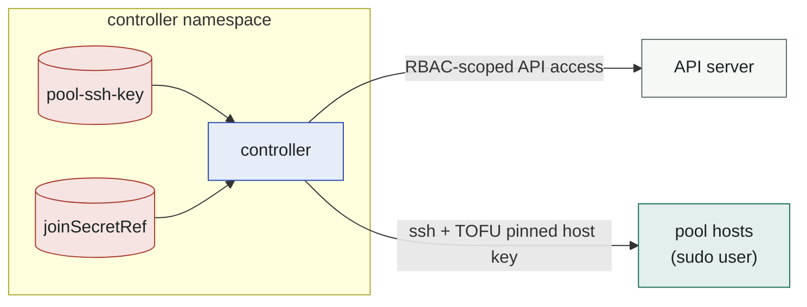

# Security model

The controller is, functionally, an SSH automation engine with cluster-admin
adjacent powers over a set of hosts. Treat its namespace accordingly.

## Trust boundaries

## SSH

- **Host keys: trust-on-first-use, then pinned.** The first successful probe
  stores the host key fingerprint in `SSHHost.status.hostKeyFingerprint`;
  any later mismatch is a hard failure (no prompt, no fallback). Pre-pin via
  the `knownHost` key in the SSH Secret to remove even the first-use window.
- **Private keys** live in a Secret in the pool namespace, mounted nowhere —
  read via the API at connect time. Use a dedicated keypair per pool with
  access to nothing else; rotate by updating the Secret (next connection uses
  it).
- **Sudo scope.** Profile scripts run as root via `sudo bash -s`. The pool
  user should exist solely for this purpose. If you need less than full sudo,
  constrain sudoers to `bash` invocations and accept that profiles effectively
  are root anyway — joining a node *is* a root operation.
- Commands travel on stdin with env exported in a preamble — nothing sensitive
  lands in argv (visible in `ps`) on the host. Secrets do end up in the
  script stream; they are not logged by the controller.

### Verified execution (opt-in)

By default, profile scripts run as root via `sudo bash -s`: whoever can write an
`SSHJoinProfile` (cluster-scoped) is effectively root on every pool host, and so
is a compromised controller. **Verified execution** removes that — scripts are
signed offline, the controller verifies before connecting, and a host-side shim
pinned by sshd `ForceCommand` re-verifies against a trusted signer before running
anything. Because the signing key stays offline, a compromised controller cannot
forge a signature the shim accepts. Off by default; enable per host with
`SSHHost.spec.execMode: Verified`. See [Verified execution](verified-exec.md).

## Kubernetes credentials

- **Bootstrap tokens** are minted per join with TTL 1 h, bound to group
  `system:bootstrappers:kpssh`. Scope that group's RBAC to exactly the
  standard node-bootstrapper role + CSR approval. No long-lived join
  credential exists.
- **Tokens are collected, not left to expire.** The token's public id is
  recorded on the host (`SSHHost.status.bootstrapTokenID`) *before* the join
  runs, and the Secret in `kube-system` is deleted:

  | when | by |
  |---|---|
  | the node registers (kubelet now holds a client certificate) | probe controller |
  | the join fails, or the host is released | instance provider |
  | the claim goes stale (NodeClaim force-deleted) | probe controller |

  A crash between minting and joining is covered too — the id on the host
  outlives the process. This matters because nothing else collects them:
  kube-controller-manager's `tokencleaner` is **disabled by default** upstream,
  so expired token Secrets would otherwise accumulate in `kube-system` forever,
  one per join.
- **`joinSecretRef` material** (e.g. EKS SSM activation id/code) reaches hosts
  only inside the join stream of a cold join. Keep the Secret's RBAC tight;
  rotate as your process requires. Activations expire server-side (max 30 d) which
  bounds the blast radius of a leak.
- Secret values and the bootstrap token are **redacted** from script-failure
  messages before they become NodeClaim events (a `set -x` join traces its own
  environment to stderr).
- The controller never stores kubeconfigs for the hosts and never fetches node
  credentials back.

## Controller RBAC

The helm chart ships scoped rules (`templates/rbac.yaml`). The controller is a
karpenter: it evicts pods and deletes nodes cluster-wide. That is the honest
summary — the details:

**Cluster-wide read** (karpenter core's scheduling simulation): pods, nodes,
namespaces, PV/PVC, apps (deployments, replicasets, statefulsets, daemonsets),
PDBs, storage.k8s.io (storageclasses, csinodes, volumeattachments),
coordination leases.

**Cluster-wide write** — the part a security review must see:

| resource | verbs | why |
|---|---|---|
| `nodes` | patch, delete | registration (labels/taints/finalizer), disruption taints, and the leave that removes the Node object — on EKS Hybrid, deleting the Node *is* how billing stops |
| `pods/eviction` | create | karpenter's drain path: consolidation evicts every pod on a node it is about to remove |
| `pods` | delete | the terminator force-deletes pods still stuck past their grace period |
| `events`, `events.k8s.io/events` | create, patch | NodeClaim and SSHHost events |
| `karpenter.sh/nodeclaims` (+status) | get, list, watch, create, update, patch, delete | karpenter core owns the NodeClaim lifecycle |
| `karpenter.sh/nodepools`, `nodeoverlays` (+status) | get, list, watch, update, patch | status only — core never creates the pools you author |
| `karpenter…/sshhosts` | get, list, watch | **read-only** — the controller cannot write your inventory's spec |
| `karpenter…/sshhosts/status` | update, patch | the claim lock is a CAS here; the probe writes state |
| `karpenter…/sshjoinprofiles` | get, list, watch | **read-only** — pure input, no status subresource |
| `karpenter…/sshnodeclasses` (+status) | get, list, watch, update, patch | the finalizer on the object, readiness on the status |

Worth stating plainly, because it is a deliberate property rather than an
accident: **the controller cannot write the `spec` of an `SSHHost` or an
`SSHJoinProfile`.** Your inventory and your join scripts are operator-owned
input. A compromised controller can change which host is claimed — it cannot
rewrite the pool or the code the pool runs.

Eviction and node deletion are inherent to what an autoscaler does; if that is
more than you want to grant, this is the wrong kind of software. What the chart
*does* keep narrow:

| namespaced Role | scope |
|---|---|
| pool secrets (pool ns) | `get` on secrets — the SSH key and `joinSecretRef` material, nothing else, nowhere else |
| bootstrap tokens (`kube-system`) | `create` + `delete` on secrets. No `get`/`list`/`update`: the controller can mint a token and delete one by exact name, but cannot read anybody's. Token names are random, so `resourceNames` cannot narrow it further |
| cluster-info (`kube-public`) | `get` on the `cluster-info` ConfigMap only — endpoint/CA discovery. The ClusterRole grants **no** cluster-wide ConfigMap read |
| leader election (release ns) | leases |

Custom join profiles that need more API access: `rbac.extraRules`.

The chart is the only supported install path, and its ClusterRole is the RBAC
the controller actually needs. If you must render the manifests yourself, use
`helm template` rather than hand-writing a Deployment — that keeps the scoped
role instead of reaching for `cluster-admin`.

## Workload isolation

- The controller Pod is restricted-PSS compliant (non-root, seccomp
  RuntimeDefault, no privilege escalation, read-only root FS, all caps
  dropped) and needs **no** host namespaces, host paths or extra caps — SSH is
  plain outbound TCP.
- **NetworkPolicy** (`networkPolicy.enabled=true`, off by default): confines the
  controller to what it actually needs — egress to the API server and to the
  pool hosts' SSH port, ingress on the metrics port. Turn it on in default-deny
  namespaces; if your pool is reachable only through a bastion or over a VPN
  interface, check the generated egress rules against that path before enabling.
- Nodes joined by this provider are regular nodes; apply your standard node
  hardening through the profile's `install` (CIS, SSH lockdown of *other*
  users, etc.).

## Reporting

Vulnerabilities: private GitHub security advisory, see
[SECURITY.md](https://github.com/dklesev/karpenter-provider-ssh/blob/main/SECURITY.md). Please do not open public issues for anything
exploitable.
