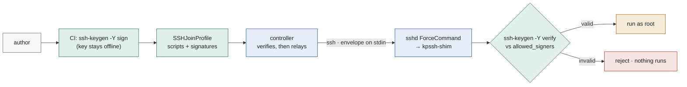
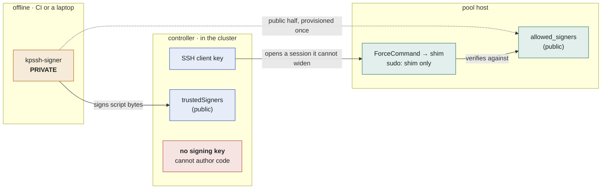

# Verified execution

Verified execution is an **opt-in** mode that replaces "pipe arbitrary root bash
over SSH" with "run only a signed script a trusted key vouched for". It closes
the largest exposure of the default model: that anything able to write an
`SSHJoinProfile` (a cluster-scoped CRD) — or a compromised controller — can run
as root on every pool host.

It uses **only stock OpenSSH on the host** (`ssh-keygen -Y verify`,
`ForceCommand`, `authorized_keys` restrictions). No agent daemon, no CA service,
no Vault. Raw mode (the default) is unchanged; migrate host by host.

## The idea in one picture



The pipeline above is *what happens*. The reason it holds is **who holds which
key** — and the controller, the component most exposed to the cluster, holds
nothing that can author code:



Both public files (`trustedSigners`, `allowed_signers`) need no secrecy — only
integrity. The one secret that matters never touches the cluster, which is why
compromising the controller does not yield the ability to sign.

Two independent checks, and the signing key touches neither:

- **Controller-side** (pure Go) — before it connects, the controller proves the
  script is signed by one of the host's `trustedSigners`. Fail-fast; it never
  even ships an unsigned or tampered script. `execMode: Verified` requires a
  non-empty `trustedSigners` (CRD-enforced), so this check cannot be disabled
  by accident.
- **Host-side** (`kpssh-shim`, pinned by `ForceCommand`) — before it runs, the
  shim re-verifies against `allowed_signers`. Because the signing key is offline,
  a compromised controller cannot forge a signature the shim would accept.

## What this does not close

Be clear about the edges before you rely on it.

- **Replay / rollback.** A signature covers the script bytes and nothing else —
  not a version, not an expiry. A controller that has been compromised can
  re-send an **older, still validly signed** script (say, a `join` you have
  since fixed) and the shim will run it. Signing is offline precisely so the
  key survives that compromise, but the flip side is that there is no online
  channel to revoke a signature. The mitigations are OpenSSH's own: give
  `allowed_signers` entries a `valid-before` and re-sign on a cadence, and
  rotate the signer if you must invalidate history.
- **Phase binding.** The `phase:` header is not covered by the signature. This
  costs little in practice — a compromised controller may legitimately ask for
  any phase — but it does mean a signature is valid for the script it signed,
  not for the operation it was signed *for*.
- **Params are not signed.** Only their names are constrained (`KPSSH_*`, so
  they cannot reach `BASH_ENV`, `LD_PRELOAD`, `PATH` and friends). Values are
  attacker-controlled data in the compromised-controller case: a signed script
  must treat `$KPSSH_*` as untrusted input, quote it, and never `eval` it.
- **The host is still the host.** Anyone with root on a pool host, or who can
  rewrite `/etc/kpssh/allowed_signers`, owns the trust root. Verified exec
  constrains the *controller*, not the machine.

## What the shim will run

The shim exposes a fixed operation vocabulary — nothing else is reachable over
the pinned SSH login:

| op | signed? | mutating | notes |
|---|---|---|---|
| `probe` | no | no | built-in read-only facts (`nproc`, memory, arch, kubelet state) |
| `install` / `join` / `leave` / `uninstall` | **yes** | yes | require a valid signature over the exact script bytes |

Exit codes: `0` ok · `1` internal error (see stderr) · `2` signature rejected ·
`3` bad param · `4` malformed envelope · `5` unknown phase · `10` the signed
script itself failed (its real exit code is in the shim's log line, so a
`systemctl` exiting 2 can never masquerade as "signature rejected").

Params reach the script as environment variables, and the shim accepts a name
only if it matches `KPSSH_[A-Za-z0-9_]+`. That is a security boundary, not
tidiness: a bare shell identifier like `BASH_ENV`, `ENV`, `LD_PRELOAD`, `PATH`
or `IFS` steers the *interpreter* rather than the script, and bash expands
`$BASH_ENV` — running any command substitution in it — before a non-interactive
script starts. Restricting names to the `KPSSH_` contract is what keeps the
param channel from becoming an execution channel.

## Scripts must be template-free

Verified profiles are signed **as bytes**: what runs must equal what was signed.
Go `text/template` actions (`{{ … }}`) render per node, so they are **rejected**
in verified mode. Move every per-node value to the `KPSSH_*` environment (the
provider already exports all of it) — the shim applies validated params, then
runs the pristine signed script. A signed script that does `eval`, `curl | bash`
or unquoted expansion is still a bug the signature does not fix; keep the
[`KPSSH_*` contract](join-profiles.md) and lint your profiles.

---

## Quickstart

End to end on one host. Assumes `ssh-keygen` ≥ 8.1 locally and on the host (see
[Requirements](#requirements)).

### 1. Create a signer (keep the private half offline)

```bash
ssh-keygen -t ed25519 -f kpssh-signer -N '' -C kpssh
# kpssh-signer      → CI secret / 1Password. NEVER on the controller or a host.
# kpssh-signer.pub  → public; goes into allowed_signers (step 2) + the SSHHost.
```

### 2. Provision the host for verified mode

Do this from your image / Ansible / cloud-init — the same automation that already
prepares the host. As root on the host:

```bash
# Fetch the shim from the release matching your controller image, and check it
# before you install it: this file runs as root on every host in the pool, so
# fetching it unverified would hand away exactly what the shim exists to
# protect. Pin VERSION — "latest" is a moving target for a root-privileged file.
VERSION=v1.0.2 # x-release-please-version
base=https://github.com/dklesev/karpenter-provider-ssh/releases/download/${VERSION}
curl -fsSLO "${base}/kpssh-shim"
curl -fsSLO "${base}/kpssh-shim.sha256"
sha256sum -c kpssh-shim.sha256   # macOS: shasum -a 256 -c

install -D -m 0755 kpssh-shim /opt/kpssh/kpssh-shim
```

The checksum only proves the two files came from the same place. To prove the
shim came from *this* repo's release workflow and not from whoever last had
write access to it, verify the build provenance instead — the signature chains
to the workflow's OIDC identity, which a release-asset overwrite cannot forge:

```bash
gh attestation verify kpssh-shim --repo dklesev/karpenter-provider-ssh

# the trust root — public key material, no secrecy needed
install -d /etc/kpssh
printf 'kpssh namespaces="kpssh" %s\n' "$(cut -d' ' -f1-2 kpssh-signer.pub)" \
  > /etc/kpssh/allowed_signers

# a dedicated pool user, sudo-scoped to exactly the shim (a real allow-list)
useradd -m kpssh
printf 'kpssh ALL=(root) NOPASSWD: /opt/kpssh/kpssh-shim\n' > /etc/sudoers.d/kpssh
chmod 440 /etc/sudoers.d/kpssh

# pin the controller's key to the shim; no pty, no forwarding, source-locked
install -d -o kpssh -g kpssh -m 700 /home/kpssh/.ssh
printf 'restrict,command="/opt/kpssh/kpssh-shim",from="%s" %s\n' \
  "10.0.0.0/8" "$(cat controller_key.pub)" \
  > /home/kpssh/.ssh/authorized_keys
chown kpssh:kpssh /home/kpssh/.ssh/authorized_keys
chmod 600 /home/kpssh/.ssh/authorized_keys

# pin the login to the shim; no pty, no forwarding
cat > /etc/ssh/sshd_config.d/50-kpssh.conf <<'EOF'
Match User kpssh
    ForceCommand /opt/kpssh/kpssh-shim
    PermitTTY no
    AllowTcpForwarding no
EOF

# validate BEFORE reloading: on RHEL-family hosts sshd reloads without a
# pre-check and dies on a config error — on a remote host that is a lockout.
# Keep a second session open the first time regardless.
sshd -t || { rm -f /etc/ssh/sshd_config.d/50-kpssh.conf; echo "config rejected"; exit 1; }
systemctl reload sshd
```

The client must not be able to set the shim's environment: the shim reads its
trust root (`KPSSH_ALLOWED_SIGNERS`) and its namespace/principal from the
environment so that provisioning can place them. `sudo` scrubs those on the
escalating path above, but a host whose `SSHHost` sets `user: root` never
escalates — let a client set the environment there and it chooses its own
`allowed_signers`, after which the signature check happily validates a key the
attacker holds. sshd's **global defaults already refuse client environment**
(no `AcceptEnv`, `PermitUserEnvironment no`; neither can be narrowed inside a
`Match` block) — just confirm nothing in your config re-enabled them:

```bash
sshd -T -C user=kpssh,host=h,addr=127.0.0.1 | grep -Ei 'acceptenv|permituserenv'
# expect: permituserenvironment no — and no acceptenv lines
```

`from=` is defense-in-depth — pin it to the pod/node subnet the host sees (or the
NAT egress IP), and enforce the same at your security group / firewall. The
force-command and the signature are what actually gate execution.

### 3. Sign the profile's scripts (offline / CI)

Keep phase scripts as files and sign each in the `kpssh` namespace:

```bash
ssh-keygen -Y sign -f kpssh-signer -n kpssh join.sh   # → join.sh.sig
# …repeat for install.sh, leave.sh, uninstall.sh
```

The helper
[`hack/sign-profile.sh`](https://github.com/dklesev/karpenter-provider-ssh/blob/main/hack/sign-profile.sh)
signs a directory of phase scripts and prints the ready-to-paste `signatures:` block:

```bash
hack/sign-profile.sh kpssh-signer ./scripts/
```

### 4. Ship the signed profile

```yaml
apiVersion: karpenter.dklesev.github.io/v1beta1
kind: SSHJoinProfile
metadata: { name: tls-bootstrap }
spec:
  version: "1"
  scripts:
    install: |
      #!/usr/bin/env bash
      set -euo pipefail
      # … template-free; reads ${KPSSH_*} …
    join: |
      #!/usr/bin/env bash
      # …
    leave: |
      #!/usr/bin/env bash
      # …
  signatures:                      # from step 3
    install: |
      -----BEGIN SSH SIGNATURE-----
      …
      -----END SSH SIGNATURE-----
    join: |
      -----BEGIN SSH SIGNATURE-----
      …
      -----END SSH SIGNATURE-----
    leave: |
      -----BEGIN SSH SIGNATURE-----
      …
      -----END SSH SIGNATURE-----
```

### 5. Flip the host to Verified

```yaml
apiVersion: karpenter.dklesev.github.io/v1beta1
kind: SSHHost
metadata: { name: host-1 }
spec:
  address: 10.0.0.11
  user: kpssh
  sshKeySecretRef: { name: pool-ssh-key }
  capacity: { cpu: "8", memory: 16Gi }
  execMode: Verified
  trustedSigners:                  # required in Verified mode; the .pub from step 1
    - "ssh-ed25519 AAAA… kpssh"
  # shimCommand: /opt/kpssh/kpssh-shim   # override if installed elsewhere
```

Set `execMode: Verified` **only after** steps 2–4 for that host. Raw and Verified
hosts coexist in one pool.

### 6. Prove it

A scale-up that lands on `host-1` now runs the signed `join` through the shim.
To confirm the gate works, ship a profile edit **without** re-signing: the
controller refuses before connecting (`controller-side signature check`), and had
it reached the host, the shim would reject it (`signature rejected`, exit 2). The
NodeClaim surfaces the rejection as an event; the host is released healthy.

---

## Operations

The only persistent state on a host is one public file (`allowed_signers`) and
one config line (`ForceCommand`). Everything that changes routinely rides the
wire, signed.

| change | what to do | touches the node? |
|---|---|---|
| **update a script** | re-sign, ship the new profile; next join picks it up | **no** |
| **rotate the signer** | mark the `allowed_signers` entry `cert-authority` and issue signer *certificates*; rotate leaves offline | **no** (with a CA) / yes otherwise |
| **re-provision** | your image / config-management actor | yes — never the controller |

The controller holds no key that produces a session broader than the shim, and no
key that signs code the shim would accept: it cannot run code the signer never
vouched for. It can still choose *which* signed code runs, and when — see
[What this does not close](#what-this-does-not-close).

## Troubleshooting

A signing or provisioning mistake never marks the host `Unhealthy` — the host
was not touched, so it returns to `Available` and the error surfaces on the
NodeClaim.

| symptom | cause | fix |
|---|---|---|
| join fails, `controller-side signature check` | profile signature missing/invalid, or signer not in `trustedSigners` | re-sign; add the `.pub` to `SSHHost.spec.trustedSigners` |
| join fails, shim exit `2` `signature rejected` | script edited after signing — or a provisioning problem: the shim logs ssh-keygen's own error (`verify: …`) alongside, e.g. a missing/unreadable `allowed_signers` | re-sign, or fix `/etc/kpssh/allowed_signers` per the logged reason |
| shim exit `4` malformed | host is force-command-locked but got a non-envelope (mode mismatch) | ensure `execMode: Verified` matches the host's actual sshd |
| shim exit `10`, `script exited N` in the log | the signed script itself failed with exit `N` | debug the script; the signature gate is fine |
| `verified exec requires template-free scripts` | profile uses `{{ … }}` | move variability to `KPSSH_*` params |
| `sudo: a password is required` | pool user lacks the NOPASSWD shim rule | add `/etc/sudoers.d/kpssh` (step 2) |

## Requirements

`ssh-keygen -Y sign`/`verify` need OpenSSH ≥ 8.1 on the signer and host;
`cert-authority` in `allowed_signers` needs ≥ 8.9. EKS AL2023 and Ubuntu 22.04+
qualify. The controller needs no `ssh-keygen` (verification is pure Go).

See also: [Security](security.md) · [Join profiles](join-profiles.md).
